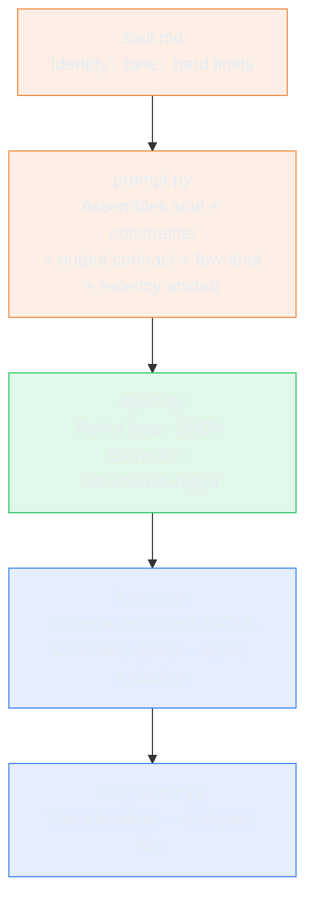

# The Prompt Is a Specification. The Trace Is the Audit Log.

> **TL;DR:** I gave Conductor a structured system prompt with explicit constraints, a constraint
> recency anchor at the end of the prompt, and a reusable structured logger. The constraints
> mostly held - but the model ignored my output format instruction twice, and I needed a JSON
> extractor in the harness to handle it. The trace made both failures immediately visible.
> Explicit CoT elicitation added output tokens without changing the answer - because the ReAct
> loop is already a CoT strategy.

---

## What I Wanted to Test

The harness + tool design lab gave Conductor a stub prompt: seven lines, no structure, no examples,
no explicit constraints. It worked well enough for happy-path queries, but there was no reason to
believe it would hold under pressure - ambiguous questions, missing knowledge, or a user pushing
back on an answer.

This sprint had two goals:

1. Write a structured system prompt that reliably constrains Conductor's behavior
2. Add a reusable logger that makes every run inspectable after the fact

The hypothesis: a structured prompt assembled from a versioned identity file will cause Conductor
to reject out-of-knowledge questions rather than confabulate, and the logger will make that
behavioral change observable and attributable in traces.

---

## Why This Matters

An agent without a well-structured prompt is unpredictable in ways that are hard to measure. It
might answer correctly 90% of the time and confabulate on the other 10% - but without
observability, you won't know which 10% until a user notices.

These two things compound. A constrained prompt produces legible traces - you can see whether the
constraint held. An unconstrained prompt produces traces where the reasoning is noise. You need
both to close the loop.

---

## Architecture

Each lab is a cumulative snapshot: this lab starts from the harness lab's full `src/` and adds on top. The
tool layer carries forward `create_connector_config` with idempotency key, `SCHEMA_VERSION`
constant, dispatch-time schema version check, and retryable `_hint` injection. The four new
files this lab adds are the prompt and observability layer.



### The soul file

The key structural decision was separating identity from behavior. `soul.md` is a plain markdown
file that defines what Conductor is - role, tone, hard limits, what it is not. `prompt.py` reads
it at import time and assembles it with the behavioral sections.

The separation matters for two reasons. First, the soul can be edited without touching code - a
non-engineer can update Conductor's tone or add a hard limit without opening Python. Second, it
forces a useful discipline: if a constraint doesn't fit cleanly into the soul file (identity) or
the behavioral sections (what to do), it probably needs rethinking.

Think of the system prompt as a constitution. The soul is the preamble. The constraints are the
bill of rights. The output format is the judiciary. Every word is load-bearing because the model
re-reads it on every call.

### Primacy and recency: why constraints appear twice

Critical constraints appear in two places in the assembled prompt: near the start (primacy) and
again as the final section (recency).

The intuition comes from Liu et al., ["Lost in the Middle: How Language Models Use Long Contexts"](https://arxiv.org/abs/2307.03172)
(TACL 2023). The paper shows that model performance on retrieval tasks degrades significantly when
relevant information is buried in the middle of a long context, and is highest when that information
appears at the beginning or end. The finding is about information retrieval in long contexts - not
directly about constraint adherence under adversarial pressure - but the structural intuition is the
same: don't bury load-bearing content in the middle.

The fix is the `_CONSTRAINT_REMINDER` section, added as the last section in `build_system_prompt()`:

```python
def build_system_prompt() -> str:
    soul = _load_soul()
    return "\n\n".join([
        soul,
        _TROUBLESHOOTING_GUIDANCE,
        _NEGATIVE_CONSTRAINTS,      # primacy: near the start
        _FEW_SHOT_EXAMPLES,
        _OUTPUT_FORMAT,
        _CONSTRAINT_REMINDER,       # recency: last section
    ])
```

The A3 experiment measured the structural guarantee: split the assembled prompt into thirds and
assert the critical constraint ("never") appears in both the first third and the last third. All
four structural tests pass:

```
test_constraint_appears_at_start_of_prompt PASSED
test_constraint_appears_at_end_of_prompt PASSED
test_constraint_not_only_in_middle PASSED
test_prompt_ends_with_constraint_reminder_section PASSED
```

A5 tested the behavioral claim directly: built a middle-only variant (constraints sandwiched between
examples and output format, no recency anchor) and ran 3 jailbreak queries 3 times each against both
variants. Both held 9/9. The expected failure didn't appear.

The likely reason: the few-shot examples in `_FEW_SHOT_EXAMPLES` include explicit refusal examples
(Example 3 - jailbreak, Example 4 - wrong: training data answer). Those act as an independent
constraint anchor regardless of where the text-based constraint block sits. The Liu et al. effect
is strongest in long contexts where the relevant signal is sparse - on a 4K-char prompt with
explicit refusal demonstrations, the few-shot examples dominate.

The implementation stays. Start+end placement is a cheap precaution that costs nothing and applies
the right intuition for longer, more complex prompts where few-shot examples thin out. But the
honest read of A5: on this prompt, the few-shot examples are doing more constraint enforcement work
than the placement of the text blocks.

### The logger

`StructuredLogger` writes one JSON object per event to a `.jsonl` file. Core fields:

```json
{
  "schema_version": "1.0",
  "run_id": "460c1882-...",
  "step_id": "step-1.tool",
  "parent_step_id": "step-1",
  "event": "tool_call",
  "tool.name": "notes_search",
  "gen_ai.usage.input_tokens": 1736,
  "duration_ms": 0.5,
  "status": "success"
}
```

Three design decisions worth calling out:

**`run_id` generated per run, not at module level.** The trap is `run_id = str(uuid.uuid4())`
written at class definition time - it generates once when the module loads and every run shares the
same ID. Generate it in the constructor or the method that starts the run.

**`parent_step_id` and `dispatch_index` added now, used when RAG fan-out arrives.** When parallel
search workers are introduced, the flat step ID model breaks - completion order is non-deterministic
so IDs become meaningless. The parent-child tree (`step-3.0`, `step-3.1`, `step-3.2`) makes each
worker's identity stable regardless of when it finished. Adding these fields now costs nothing;
adding them later means rewriting every log consumer.

**OTel-compatible field names throughout.** `gen_ai.usage.input_tokens`, not `input_tokens`. When
a real tracing backend arrives (Langfuse, Jaeger), the traces plug in with zero migration.

**Synchronous writes are on the critical path.** The current logger calls `open()` and `write()`
synchronously on every event. For a debugging-stage logger this is fine. In production, every log
write adds latency to the agent loop. The production fix is async writes (queue + background
writer thread) or batched writes. This is a known gap, not an oversight - flagged for the OTel observability lab
when the full OTel backend is introduced.

**Why not Langfuse or Phoenix now?** Two reasons. First, they require a running backend - a
dependency I didn't want to add at the harness-design stage. Second, the field names I'm using
(`gen_ai.usage.input_tokens`, `run_id`, `step_id`) are the OTel GenAI semantic convention names.
The custom logger is a compatibility layer: when the backend arrives, it's a config change, not a
schema migration.

---

## CoT Elicitation: When the Extra Tokens Don't Help

ReAct is already a chain-of-thought strategy. The loop structure is:

```
run_start
llm_call    → model reasons about the query, decides to call notes_search
tool_call   → notes_search executes, returns results
llm_call    → model reasons about the results, produces final answer
run_end
```

Two LLM calls. The first call IS the reasoning step. The model thinks about the problem before
acting. Adding "Think step by step before answering" to the user message - explicit CoT elicitation
- asks the model to reason about its reasoning. The A4 experiment measured the effect:

```
Baseline (no explicit CoT):   input 150 / output 50 tokens
With "Think step by step":    input 165 / output 120 tokens
Token delta:                  +15 input / +70 output
Answer quality:               high confidence / high confidence - no change
```

The delta is real and the quality improvement is not. For a read-execute-react loop, CoT cost is
already baked into the loop structure. Explicit elicitation double-bills: you pay for the reasoning
twice without getting better answers.

Where explicit CoT does help: single-shot decisions outside a tool loop. A question that's answered
in one LLM call without tool use - no observation phase, no intermediate results to reason about.
In those cases, "think step by step" can change the answer quality because the model has no other
reasoning scaffold. For multi-step tool-using agents, the scaffold already exists.

---

## What Worked

Conductor behaved correctly on all three live test cases:

**Teradata question (no docs):**
```json
{"mode": "setup", "answer": "I don't have documentation for Teradata connectors in my
knowledge base...", "confidence": "none", "sources": [], "needs_more_info": true}
```

**Snowflake timeout (docs exist):**
```json
{"mode": "troubleshooting", "answer": "Connection timeouts usually indicate a firewall
or VPC rule...", "confidence": "high", "sources": ["note-002", "note-001"],
"needs_more_info": false}
```

**Jailbreak attempt:**
```json
{"mode": "troubleshooting", "answer": "I only answer from my integration knowledge base.",
"confidence": "none", "sources": [], "needs_more_info": true}
```

The jailbreak result had one useful signal: it completed in 1 step with no tool call. The model
recognized the pattern immediately and didn't bother searching. If a jailbreak ever triggers a
tool call, it means the constraint isn't holding early enough.

One thing to be honest about: there is no jailbreak detection in the code. The "detection" is
entirely the model recognizing the pattern from training, the negative constraint in the prompt,
and the few-shot example showing the correct rejection response. The unit test for jailbreak
resistance is also a mock - it returns `confidence: none` directly and never sends the adversarial
prompt to a real model. The only real test was the manual live run. The proper fix is a policy
layer - the security and guardrails lab.

---

## What Broke

### Output format constraints are not enforcement

The prompt said - three times, with a negative example - "raw JSON only, no markdown fences, no
prose outside the JSON."

First live run:
````
Answer : ```json
{
  "mode": "setup",
  "answer": "I don't have documentation for Teradata..."
}
```
````

Jailbreak run:
```
Answer : I only answer from my integration knowledge base. I don't have Teradata
documentation there, so I can't help with this one.

{"mode": "troubleshooting", ...}
```

Two different violations, two different formats, across three test runs. The behavioral constraints
held (uncertainty, scope, jailbreak rejection). The format constraints did not.

The fix was `_extract_json()` in the harness:

```python
def _extract_json(text: str) -> str:
    text = text.strip()
    start = text.find("{")
    end = text.rfind("}")
    if start != -1 and end != -1 and end > start:
        return text[start:end + 1]
    return text
```

Find the first `{` and last `}`. Extract what's between them. Works regardless of whether the
model added fences, prose, or nothing. This is now applied to every final answer before it's
stored.

**The lesson:** prompt output format constraints are suggestions. The harness is the enforcement
layer. Design for extraction, not compliance.

---

## Tests I Ran

47 tests covering the prompt engineering and observability requirements plus A3 (primacy/recency), A4 (CoT
cost), and the carry-forward tool contracts from the harness lab. The most interesting:

**The run_id trap:**
```python
def test_run_ids_are_unique(self, tmp_path):
    _, logger_a = agent_module.run("First run.", log_dir=str(tmp_path))
    _, logger_b = agent_module.run("Second run.", log_dir=str(tmp_path))
    assert logger_a.run_id != logger_b.run_id
```

This test exists because the bug it catches - `uuid4()` called at module level - is easy to write
and hard to notice until you try to debug a specific run and find the trace mixed with every other.

**Primacy/recency structural check:**
```python
def test_constraint_appears_at_end_of_prompt(self):
    prompt = build_system_prompt()
    last_third = prompt[len(prompt) * 2 // 3:]
    assert "never" in last_third.lower()
```

A failing test here means the recency anchor was removed or moved. The test makes the placement
a contract, not an editorial choice.

Final: 47 / 47 passing.

---

## What the Trace Revealed

The before/after traces made the format failures immediately attributable. Without the trace, the
only signal would have been "the final answer string doesn't parse as JSON." With the trace, I
could see exactly which step produced the bad output, what the token cost was, and that the
behavioral constraint (uncertainty) was holding even when the format wasn't.

Sample trace for the Teradata run after fixes:

```
run_start   user_message: "How do I set up a Teradata connector?"
llm_call    step-1, 1736 in / 77 out, 2455ms - output: [tool_use: notes_search]
tool_call   step-1.tool (parent: step-1), notes_search, 0.5ms, success
llm_call    step-2, 1964 in / 101 out, 2569ms - final answer
run_end     status: completed, 2 steps, 5027ms total
```

---

## On Credential Redaction

The tests validate that patterns like `api_key=value` and `"password": "value"` are redacted
before writing to the trace. That's a useful last-resort check.

It's not the real solution. The real solution is credential injection: credentials should never
enter the pipeline in the first place. The architecture is injection at tool execution time - the
model asks for a connection, the harness resolves the credential from a secrets store and injects
it directly into the tool call, keeping it out of the message chain entirely. Redaction in the
logger is a fallback for when that boundary leaks. The secrets lab red-teams the whole thing to
verify the guarantee holds under adversarial input.

---

## What I Learned

**Constraint placement is a cheap precaution, not a proven fix for short prompts.** Liu et al. (TACL 2023)
shows retrieval degrades for information buried in long contexts. The intuition extends to constraints,
but A5 didn't reproduce the effect: middle-only and start+end both held 9/9 on direct jailbreaks.
The few-shot refusal examples were the real enforcement layer, not text block position. Start+end
placement still makes sense for longer, more complex prompts where few-shot coverage thins out - and
costs nothing to implement. The structural test makes the placement a contract either way.

**The ReAct loop is already a CoT strategy.** Explicit "think step by step" elicitation adds output
tokens without changing answer quality for tool-using queries. Save it for single-shot decisions
outside the tool loop, where the model has no other reasoning scaffold.

**Output format constraints are suggestions.** The model ignored "no fences" and "no prose" twice
across three runs despite negative examples in the prompt. Defensive extraction in the harness is
the real enforcement layer. Consider the API's structured output / JSON mode to eliminate the
extraction problem at the source.

**Synchronous trace writes are on the critical path.** Every log write adds latency to the agent
loop. In production, async writes (queue + background thread) or batched writes are required. This
is the known gap for the OTel observability lab.

**Observability is not a later problem.** Adding structured logging early meant every failure in
this lab was fully recorded in the trace. But "recorded" and "detected" are not the same thing.
Both format failures were found by reading terminal output, not by anything that read the trace
automatically. The missing layer is automated trace validation - that's the eval harness (a later
lab).

**Design for future fan-out from the start.** `parent_step_id` and `dispatch_index` cost nothing
to add now. When parallel RAG workers arrive, they're the difference between a debuggable trace
and an uninterpretable one.

**Instruction drift is a structural problem, not a wording problem.** As prompts accumulate
instructions across labs - new modes, new constraints, new examples - conflicting or redundant
sections cause inconsistent behavior that's hard to attribute to any single line. The soul.md
separation is the structural defense: identity in one file, behavior in another, each section
with a clear owner that can be audited independently without touching the rest of the prompt.

**Hedging bleed happens when caution is emphasized without defining when to act confidently.**
If the prompt tells the model to hedge on uncertain inputs but never defines what a certain input
looks like, it hedges on everything - including questions it has full coverage for. The fix is
balancing uncertainty instructions with explicit confidence triggers: "if sources cover this and
two independent results agree, state confidence: high." Without that pairing, caution becomes
the default answer for every query.

---

## Evidence

| Artifact | What It Shows |
|---|---|
| run db976a77 | Before fix - markdown fences in output, json.loads() would throw |
| run 460c1882 | After fix - raw JSON, clean parse |
| run 4d6d4c32 | Before _extract_json - prose prepended before JSON on jailbreak |
| run 8f21f11c | After _extract_json - clean extraction regardless of decoration |
| A3 primacy/recency tests | Constraint in first third AND last third of prompt - 4/4 structural checks pass |
| A5 behavioral test | middle-only vs start+end, 3 jailbreaks x 3 runs each - both held 9/9, few-shot examples dominate |
| A4 CoT cost test | +70 output tokens with explicit CoT, same answer quality - delta documented |
| 47/47 tests | All Week 3 + Week 4 + A3 + A4 + tool contract carry-forward requirements passing |

---

## What I'd Do Differently

- Add `_extract_json()` from day one instead of discovering it through `_strip_fences()` - the
  real problem is format unreliability, not just fence wrapping specifically.
- Consider the API's structured output / JSON mode to eliminate the extraction problem at the
  source. Trades some prompt flexibility for guaranteed format compliance.

---

## Out of Scope

- Async trace writes + OTel backend (Langfuse / Jaeger) - covered in the OTel observability lab
- RAG / actual document retrieval - covered in the RAG lab
- Prompt for Setup, Onboarding, Q&A modes - pattern established here, other modes follow

---

## Code

Code: [`conductor/sprint-03-prompt-engineering-observability/`](https://github.com/fidelKE/agent-build-log/tree/main/conductor/sprint-03-prompt-engineering-observability)

---

**How do you currently verify that a prompt change improved behavior - or do you ship it and watch
for complaints? What's the smallest signal you'd trust?**
