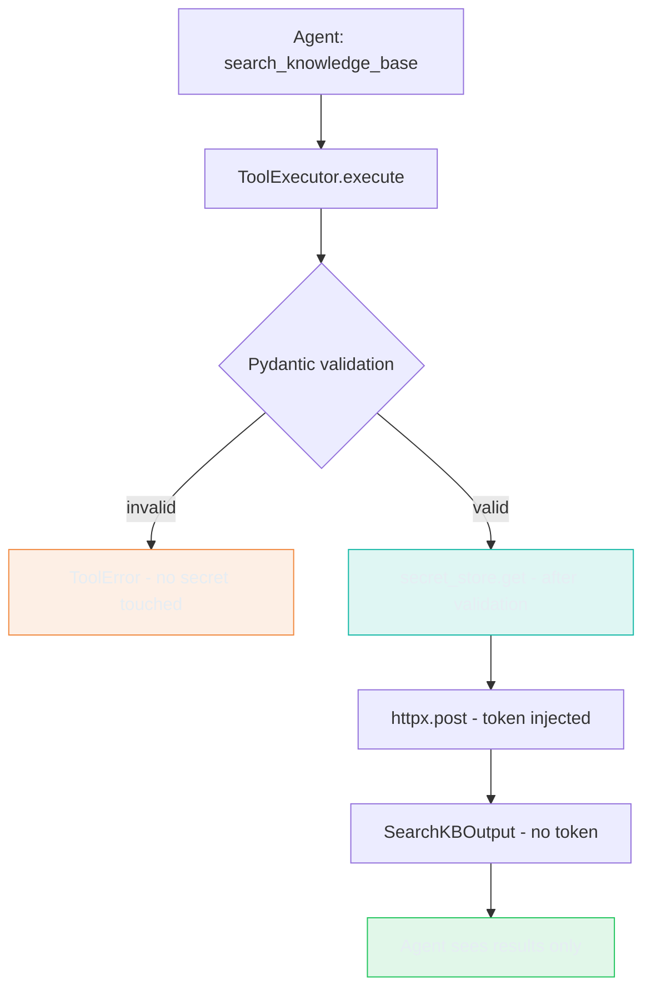
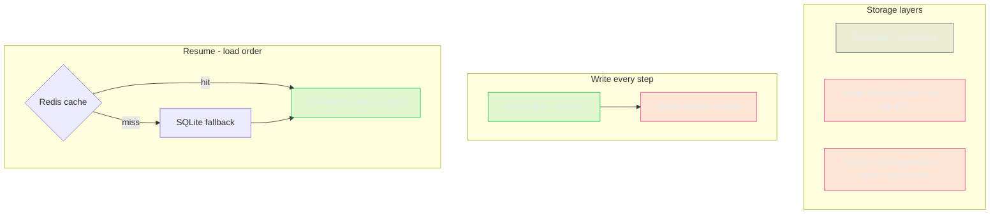

# The Agent Can't Leak What It Never Had: Secrets and Storage

> **TL;DR:** I wired credential injection for a real API, per-agent Vault identity, an Agent Bill
> of Materials with drift detection, Redis session state, and SQLite crash recovery - proved the
> token never appeared anywhere it shouldn't - and discovered that a 401 from a tool call tells
> you nothing about where the failure is. A dependency scan found zero CVEs in this lab's direct
> dependencies. The same threat model that requires credential injection also requires prompt hash drift
> detection: a rotated credential is useless if the system prompt has been silently modified.

---

## What I Wanted to Test

Three questions, one sprint:

1. Can credential injection at the harness layer keep an API token out of the model's context,
   logs, and checkpoint records - even when the model is actively asked for it?
2. Does giving each Conductor mode its own Vault path prevent cross-mode credential access?
3. Does SQLite checkpointing let a multi-step flow resume from the crash point rather than restart
   from the beginning?

And one gap I hadn't addressed yet: supply chain security. The five runtime
principles (no credentials in context, log redaction, no credential in DB, prompt injection
resistance, secret rotation) protect the running agent. They don't protect the pipeline that
assembled it.

---

## Why This Matters

The naive approach to all of these creates the same category of mistake. Put credentials in the
system prompt - now every prompt injection attempt is a credential extraction attempt. Use one
shared Vault path for all agent modes - now a Setup tool can read the Troubleshooting credential
if it knows the key name. Store state only in memory - now a crash at step 4 of 8 sends the user
back to step 1. Ship without checking prompt hashes - now a silently modified system prompt passes
all runtime tests.

All four patterns must be load-bearing from the first real API call. Retrofitting any of them
after the fact is a full audit.

---

## Architecture



For storage, state flows through three complementary layers:



**Redis is the fast path. SQLite is the truth.** On resume, Redis is checked first - it's faster
and avoids a DB read when the session is fresh. If Redis has nothing (TTL expired, Redis down,
first run after a deploy), SQLite has the same message history and serves it instead. The model
gets the full prior conversation either way.

**Hot/warm/cold tiering, named explicitly.** Redis is the hot layer: low latency, acceptable to
lose on TTL expiry - session history is valuable but reconstructible. SQLite is the warm layer:
survives crashes and process restarts, permanent until explicitly reset - step progress and message
history need this durability contract. MinIO (provisioned in `docker-compose.yml`, not yet wired)
is the cold layer: long-term audit and archiving of trace files - low access frequency, very high
durability. Each tier matches a different durability requirement. Mixing them into one store hides
this distinction until you're debugging a production incident.

---

## Implementation

### Secrets: `SecretStore` protocol with two implementations

```python
@runtime_checkable
class SecretStore(Protocol):
    def get(self, key: str) -> str: ...
    def available(self) -> bool: ...
```

`LocalStubSecretStore` reads from environment variables. `VaultSecretStore` fetches from
HashiCorp Vault KV v2 dev mode. Switching is one constructor argument: `make_secret_store(prefer_vault=True, scope="setup")`.
The `scope` parameter flows through to `VaultSecretStore`, so the factory is the single switch
point for both backend and identity. No other code changes - the protocol enforces the contract.

### Per-agent identity: two Vault scopes

A single `conductor/` Vault path for all modes means a Setup tool could read the Troubleshooting
credential if it knew the key name. That's not credential injection - it's credential sharing.

The fix is per-agent Vault paths. Each mode gets its own scope:

```
conductor/troubleshooting/catalog-api-token
conductor/setup/setup-api-token
```

`VaultSecretStore` now accepts a `scope: str` parameter:

```python
class VaultSecretStore:
    def __init__(
        self,
        address: str = "http://localhost:8200",
        token: str = "dev-root-token",
        mount: str = "secret",
        path_prefix: str = "conductor",
        scope: str = "troubleshooting",   # NEW
    ):
        ...

    def get(self, key: str) -> str:
        url = f"{self._address}/v1/{self._mount}/data/{self._path_prefix}/{self._scope}/{key}"
```

A Setup-scoped store asking for `catalog-api-token` hits
`conductor/setup/catalog-api-token` - a path that doesn't exist. Vault returns 404. The store
raises `KeyError` with the scope named in the message so the operator knows exactly which path to
check. Cross-scope access fails at fetch time, not downstream as a mysterious 401.

```python
def test_setup_scope_cannot_read_troubleshooting_credential():
    setup_store = VaultSecretStore(address="http://localhost:19999", scope="setup")
    # Mock Vault returns 404 for conductor/setup/catalog-api-token
    with patch("httpx.get", return_value=mock_404):
        with pytest.raises(KeyError) as exc_info:
            setup_store.get("catalog-api-token")
    assert "setup" in str(exc_info.value).lower()
```

In production, each mode would run with a distinct Vault token that only has read access to its
own path prefix. This sprint uses the root dev token for simplicity, but the path isolation is
real and tested.

### Storage: `SessionStore` + `AgentState` + `CheckpointStore`

```python
@dataclass
class AgentState:
    session_id: str
    task_id: str
    current_step: int = 0
    completed_steps: list[int] = field(default_factory=list)
    status: str = "in_progress"
```

On each loop iteration, three writes happen - SQLite first (durable), then Redis (cache):

```python
checkpoints.save(agent_state)                              # step progress -> SQLite
checkpoints.save_messages(session_id, task_id, messages)   # messages -> SQLite
sessions.save(session_id, task_id, messages)               # messages -> Redis (cache)
```

On the next call, the load path tries Redis first and falls back to SQLite:

```python
saved_messages = sessions.load(session_id, task_id)    # try Redis first
if not saved_messages:
    saved_messages = checkpoints.load_messages(...)    # SQLite fallback
```

The model receives the full conversation history whether it came from Redis or SQLite. TTL expiry
changes the read path, not the result.

### Message history validation on resume

The Anthropic API rejects histories with orphaned `tool_use` blocks - assistant messages with a
tool call but no matching `tool_result`. A crash between dispatching a tool and appending the
result produces this. On load, `_messages_are_valid()` checks for this and discards both Redis
and SQLite state if found, rather than sending invalid history and getting a 400.

---

## Supply Chain Security

The five runtime principles protect the running agent. Supply chain security protects the pipeline
that assembled it. They address different threat surfaces, and you need both.

The same threat model that requires credential injection also requires prompt hash drift detection.
A rotated credential is useless if the system prompt has been silently modified. If `soul.md`
changes between the security review and the next deploy, the runtime tests pass - no credential
leaked, no unauthorized API call. But the behavior may have changed.

### Agent BOM (ABOM)

`agent-bom.yaml` registers the identity of every pipeline component at signing time:

```yaml
schema_version: "1.0"

model:
  id: claude-sonnet-4-6
  provider: anthropic
  pinned: true

prompt:
  file: src/soul.md
  sha256: 3cd3bbb916677e3f08b136b2ee542d0a7c602ea1b9d2866b1893c0ce8446a7a2

tools:
  - name: tools.py
    file: src/tools.py
    sha256: a01ac466ef9cf55fb4dacf5c47a2d62b33b0b8b69d24fb11963cdea131fbb524
  - name: secrets.py
    file: src/secrets.py
    sha256: 18f8d1d79d1a1e9f96a903e4d9423c833262b07e8a28941d07bd9d18ee3f3e05
  - name: agent.py
    file: src/agent.py
    sha256: 1da224b504328c077c1265dba00a65301958c6716559a0fcf1473b95a49068ed
  - name: state.py
    file: src/state.py
    sha256: d1ea6791ec9f1263136120cf75ad47c91c15d0da7dd92fdfae5da2c6853e1f96

secrets_store:
  type: vault-kv-v2
  version: "1.17"

eval_dataset:
  file: ../../evals/datasets/conductor-v1-approved.yaml
  sha256: a561bc0aeedcebe633f7f13b39334be3ae717667ebfd862e3f3a79b9fffb3706

judge_models: []  # populated in the memory and evals lab when the eval harness is introduced
```

`bom_validator.py` computes current sha256 of each registered file and exits non-zero on any
mismatch:

```bash
$ python bom_validator.py
BOM OK - 9 components verified, no drift detected

# After a 1-character edit to soul.md:
$ python bom_validator.py
BOM VALIDATION FAILED - component drift detected:
  DRIFT: src/soul.md
    expected: 3cd3bbb916677e3f08b136b2ee542d0a7c602ea1b9d2866b1893c0ce8446a7a2
    actual:   a2b4c6d8...
```

The test for this is deterministic: create a known-hash soul.md, write an ABOM with that hash,
modify soul.md by one character, run the validator, assert it returns a drift error. Drift detection
proved by test, not just documentation.

### Dependency scanning

`pip-audit` run against this lab's direct dependencies - `anthropic`, `httpx`, `python-dotenv`,
`redis`, `pyyaml`:

```
Result: zero CRITICAL/HIGH CVEs in this lab's dependency set.
```

(The shared venv also contains packages from other labs - langchain, torch - which have CVEs in
those labs' own dep trees. Those are out of scope for this lab.)

### Runtime drift check

`bom_validator.py` is a pre-run gate. Runtime monitoring - detecting prompt drift while the agent is running - is the other half of the picture. At `run()` startup, `agent.py`
now computes `soul.md`'s sha256 and compares it against the ABOM-registered hash. A mismatch
logs a warning rather than crashing - the hard gate is `bom_validator.py`, but the runtime
signal means a stale ABOM is visible in traces before it causes a problem.

### What's deferred

SLSA provenance signing, CycloneDX SBOM (`cyclonedx-py`), and MCP server schema pinning are all
deferred to the MCP hardening lab. The ABOM is not a replacement for a full SBOM - it's a lightweight hash-check layer
for the sprint-scale pipeline.

---

## What Broke

**A 401 tells you nothing about where the failure is.**

Vault was running. The seed script exited cleanly. The container passed health checks. Every tool
call returned 401. The credential stored in Vault was an empty string.

The seed script had used `$CATALOG_API_TOKEN` which was unset after an env var rename. Vault
stores empty strings without complaint - it has no opinion about values.

But the deeper problem was not the empty string. It was that a 401 HTTP response looks identical
whether:
- Vault returned an empty string (provisioning error)
- Vault returned an expired token (rotation lag)
- The token is valid but the wrong scope (permission error)
- The API endpoint changed (configuration error)

All four produce the same 401. Without a diagnostic layer at the credential fetch step, the only
way to distinguish them is to read Vault directly and compare. That's not a debugging workflow -
it's guesswork.

The fix in two parts. First, `vault_setup.sh` now reads the written value back before exiting:

```bash
vault kv get -field=value secret/conductor/catalog-api-token | sed 's/./*/g'
echo "Done. Vault seeded successfully."
```

Second, `VaultSecretStore.get()` validates that the returned value is non-empty and raises a
`KeyError` with a specific message:

```python
value = data["data"]["data"]["value"].strip()
if not value:
    raise KeyError(
        f"Vault: secret '{key}' is empty in scope '{self._scope}' - "
        f"check seed script (vault kv get secret/conductor/{self._scope}/{key})"
    )
```

Combined: clear failure at provisioning time rather than a mysterious 401 at call time.

---

## Tests I Ran

48 tests, all passing:

```
test_tool_schema_has_no_auth_fields                         PASSED
test_redacting_formatter_scrubs_bearer_token                PASSED
test_checkpoint_payload_contains_no_credential              PASSED
test_tool_executor_never_returns_token_in_result            PASSED
test_checkpoint_resume_after_simulated_crash                PASSED
test_explicit_restart_clears_checkpoint                     PASSED
test_secret_rotation_no_code_change                         PASSED
test_duplicate_checkpoint_upserts_not_appends               PASSED
test_corrupted_checkpoint_raises_on_load                    PASSED
test_session_store_fallback_save_and_load                   PASSED
test_session_store_messages_not_shared_across_sessions      PASSED
test_sqlite_message_fallback_used_when_redis_unavailable    PASSED
test_vault_get_missing_key_raises_key_error                 PASSED
test_vault_get_empty_value_raises_key_error                 PASSED
test_vault_get_whitespace_only_value_raises_key_error       PASSED
test_vault_get_valid_value_returns_stripped                 PASSED
test_bom_validates_clean_when_hashes_match                  PASSED
test_bom_detects_drift_when_soul_modified                   PASSED
test_setup_scope_cannot_read_troubleshooting_credential     PASSED
test_vault_scope_is_included_in_path                        PASSED
...28 more
```

Three tests worth highlighting:

**`test_bom_detects_drift_when_soul_modified`** - writes a known-hash soul.md, generates an ABOM
with that hash, modifies soul.md by one character, runs `validate()`, asserts a `DRIFT` error.
Drift detection proved by test, not by documentation.

**`test_setup_scope_cannot_read_troubleshooting_credential`** - creates a Setup-scoped store,
mocks Vault returning 404 for the Setup path, asserts `KeyError` with "setup" in the message.
Cross-scope access blocked at the Vault URL level.

**`test_vault_get_empty_value_raises_key_error`** - mocks Vault returning an empty string value,
asserts `KeyError` with "empty". The 401-silent-failure mode is caught here, not two layers up.

Final: 48/48 passing.

---

## Static vs. dynamic credentials

Most agent tutorials use static credentials: a `.env` file, an environment variable set at deploy
time, one value that lives for the lifetime of the process. It works until it doesn't, and the
failure mode is not obvious until you're in it.

| | Static (env var / `.env`) | Dynamic (Vault / secrets manager) |
|---|---|---|
| **Complexity** | Minimal - no external service | Moderate - Vault or equivalent required |
| **Rotation** | Requires redeploy; old credential active until restart | Zero-downtime - new value available on next fetch |
| **Latency** | Zero - already in memory | 1-10ms per fetch (Vault KV, typical for local deployment) |
| **Audit trail** | None | Full - every read is a Vault audit log entry |
| **Secret exposure window** | Entire process lifetime | Single request duration |
| **Best for** | Local dev, single-process scripts | Any agent making authenticated API calls in production |

The architecture decision is not "Vault vs. env vars." It's: should credential rotation require
touching the running agent? If the answer is no, the credential can't be in the process environment.

This lab uses static long-lived tokens stored in Vault - a catalog API token written at seed time
that doesn't expire. That's one step better than a plain env var (it's centralized and audited),
but it's still a static credential with no automatic rotation. The production pattern is dynamic
short-lived credentials with a TTL: credentials generated on demand by Vault's dynamic secrets
engine, valid for an hour, automatically rotated before expiry. Dynamic credentials mean a leaked
token is useful for at most one hour, and rotation is a Vault operation with no code change and no
redeploy. The current implementation avoids that dependency at this stage - Vault's dynamic secrets
engine requires additional configuration beyond KV v2. That's the right next step for the secrets
architecture when this goes to production.

This lab uses Vault because the full stack (Vault, Redis, Qdrant) already runs in the
`docker-compose.yml` for later labs.

---

## What I Learned

**Credential injection is not a nicety - it's the only architecture that survives prompt
injection.** Mitigation via model instructions is not load-bearing. The model can't exfiltrate
what it never received.

**A 401 is not a credential failure - it's a category of failure.** The credential fetch, the
credential value, the token scope, and the API endpoint are four separate failure points that all
produce the same HTTP status. Validate non-empty at fetch time; read back at seed time; include
scope in error messages. Otherwise debugging is guesswork.

**Per-agent identity is enforcement, not documentation.** A shared Vault path with access
controlled only by policy is still a misconfiguration away from cross-mode credential access.
Separate paths and separate tokens make the boundary structural.

**The same threat model that requires credential injection also requires prompt hash drift
detection.** Runtime tests confirm the token never leaked. They don't confirm the prompt that
constrains token handling hasn't changed. The ABOM closes that gap - both as a pre-run validator
and as a runtime check at `run()` startup that logs a warning if `soul.md` has drifted since
the last BOM was generated.

**Hot/warm/cold tiering is a failure-contract decision.** Redis (hot): low latency, acceptable to
lose on TTL expiry. SQLite (warm): survives crashes and restarts, permanent. MinIO (cold, the OTel observability lab):
long-term trace archiving, rarely read. The tier names aren't jargon - they're the durability
contracts you need to reason about when something fails.

**Event sourcing vs. checkpointing: know which one you need.** This sprint delivers checkpointing:
save current state, resume from it on crash. Event sourcing would store an immutable append-only
log of every step's input and output, allowing full replay and audit. Checkpointing is the right
choice for crash recovery in a ReAct loop. Event sourcing is the right choice for compliance-heavy
deployments where you need to prove what happened and in what order. The tradeoff flips when the
audit requirement arrives.

The JSONL trace log is structurally similar to an event log - each event is appended and never
updated, and the full run state can be reconstructed by reading events in order. That's the event
sourcing pattern applied to agent observability. The difference from full event sourcing is
deliberate: the current implementation also writes a SQLite checkpoint for fast resume (a mutable
snapshot of current progress), rather than replaying the entire JSONL history to recover state.
Snapshot plus log is a standard pattern in event-sourced systems - pure replay is correct but slow
when the log is long.

**"Resume with context" and "skip completed steps" are different things.** This sprint delivers
resume with context: the model reads the full history and continues reasoning. Skipping completed
steps - replaying tool outputs from storage instead of re-running the tool - requires each step's
isolated inputs and outputs stored separately. That's what workflow orchestration adds in a later
lab.

---

## Evidence

| Artifact | What It Shows |
|----------|---------------|
| `test_bom_validates_clean_when_hashes_match` | ABOM validates clean when all hashes match |
| `test_bom_detects_drift_when_soul_modified` | ABOM detects drift on 1-char soul.md edit |
| `test_setup_scope_cannot_read_troubleshooting_credential` | Cross-scope Vault access blocked at URL level |
| `test_vault_scope_is_included_in_path` | Vault URL contains scope in path |
| `pip-audit` output | Zero CRITICAL/HIGH CVEs in this lab's direct dependencies |
| `test_tool_executor_never_returns_token_in_result` | Token absent from tool output at the unit level |
| `test_checkpoint_payload_contains_no_credential` | Token absent from every column in both the `checkpoints` and `messages` tables |
| `test_checkpoint_resume_after_simulated_crash` | Resume from step 3, not step 1, after simulated crash |
| `test_sqlite_message_fallback_used_when_redis_unavailable` | Full message history served from SQLite when Redis returns nothing |
| `test_vault_get_empty_value_raises_key_error` | Empty Vault value raises at fetch time, not as a 401 two layers up |
| `screenshots/run-viewer-credential-injection.txt` | `auth_header: [not logged]` on HTTP calls - credential injection confirmed |
| Live prompt injection run | Model cannot echo what it never received |

---

## Out of Scope

- SLSA provenance signing, CycloneDX SBOM, MCP server schema pinning - the MCP hardening lab
- Full prompt injection defense (guardrails, output validation) - the security and guardrails lab
- L2 (Chroma) wiring - belongs in the RAG sprint when semantic retrieval is needed
- L4 (MinIO) wiring - belongs in the observability sprint when trace archiving is needed
- Automated tier migration (warm to cold background process) - no background workers yet; this lab provisions the tiers and routes writes manually
- Multi-tenant credential isolation - belongs in the multi-tenancy sprint

---

## Code

Code: [`conductor/sprint-04-secrets-storage/`](https://github.com/fidelKE/agent-build-log/tree/main/conductor/sprint-04-secrets-storage)

---

**When a tool call fails with a 401, how do you tell which layer failed - the credential fetch,
the value, the scope, or the endpoint? And does your deployment pipeline currently check whether
the system prompt has been modified since the last security review?**
