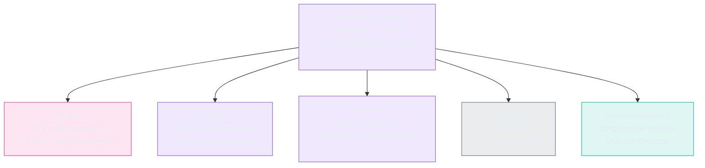
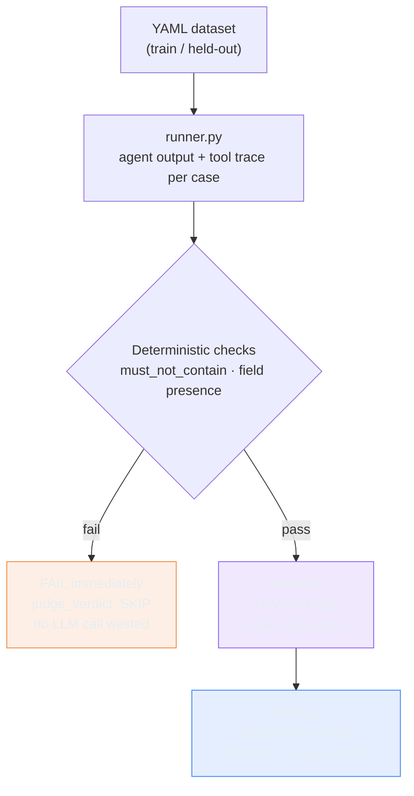

# Memory Without Measurement Is Guesswork

> **TL;DR:** I built five memory providers, wired an eval harness, seeded prior session context into each provider, and ran the comparison. Adding memory context made every provider score equal or worse. That's not a broken memory system. It's a broken eval design - and understanding why is the most useful thing this lab produced. I also added summary/compression memory, split the dataset into train and held-out sets, and added dataset health metrics - three gaps that would have silently degraded the harness if left open.

An eval that doesn't require recall can't measure memory. The rule: the eval case must require the capability you're testing to pass. If a case can pass without memory retrieval, you're not measuring memory - you're measuring general agent quality and calling it a proxy.

That's the most useful thing this lab produced. The rest of it - five providers, a compression wrapper, a train/held-out split, dataset health metrics - is the scaffolding that made the finding possible.

## What I Wanted to Test

Four questions at the same time.

First: does memory actually improve Conductor's answer quality - and does the provider choice matter? I built five providers (Redis, Qdrant, Mem0 library, Mem0 server, in-memory), seeded identical prior session context into each, and ran the same eval suite across all of them. Same starting point, different retrieval mechanisms, measurable delta.

Second: is an LLM-as-judge eval harness stable enough to detect regressions - or does judge variance swamp the real signal?

Third: does summary/compression memory actually reduce token count - or does summarizing N entries produce something longer than the originals?

Fourth: does the eval dataset have a contamination risk - am I iterating on the same cases I'll use for final quality assessment?

You need all of these at the same time. Memory without measurement is untestable. Measurement without stability is untrustworthy. A harness without a held-out set is a harness that overfits.

## What Memory Is For

Memory answers one question: what is true about this specific user's history? The correct answer changes depending on who is asking and what they've done before.

- "I'm still having that Snowflake timeout" - memory tells the agent the user already tried increasing `query_timeout` to 30,000ms. Without it, the agent asks again.
- "Set up my Redshift connector again" - memory tells the agent this user uses IAM auth and VPC peering. Without it, the agent starts from scratch.

Memory is cross-session, per-user, personal context. It does not answer: what is true about Snowflake, BigQuery, or dbt? Those are shared facts, the same for every user - they belong in a knowledge base.

The combination is where it gets interesting. Bob is troubleshooting a BigQuery 403. Memory tells the agent Bob already has `bigquery.dataViewer` and rotated his service account key two days ago. The KB tells the agent that `bigquery.jobUser` is the commonly missing role after a key rotation. Together: "Based on your key rotation and your existing `dataViewer` role, the missing piece is almost certainly `bigquery.jobUser`." Without memory, the KB alone produces: "Check your IAM roles." Not wrong. Not specific.

**The four memory types:**

| Type | Stores | Updated when | Layer |
|---|---|---|---|
| **Episodic** | What happened - specific past interactions | After each task | Vector DB |
| **Semantic** | What is true - facts, user preferences | Continuously extracted | Vector DB |
| **Procedural** | How to do it - rules, best practices | After failure analysis | System prompt |
| **Working** | What I'm doing now - active task state | Per step | Redis/in-memory |

Procedural memory is the leverage point: a rule like "when timeout persists past 30s and VPC is verified, check Serverless autopause first" applies to every future session automatically - not just the user who triggered it. This sprint builds episodic and semantic memory. Procedural memory is a later lab.

**Mode-to-memory mapping:**

| Mode | Memory | KB | Why |
|---|---|---|---|
| Troubleshooting | Yes - what did they try, what connector, what error | Yes - what causes this error, what fixes it | Memory makes the answer specific; KB makes it correct |
| Setup | Yes - what step are they on, what auth method | Yes - required fields, configuration options | Resume without starting over |
| Onboarding | Yes - role, first source connected, preferences | Less - mostly procedural | Personalize first-run experience |
| Knowledge Q&A | No | Yes - this mode is a KB lookup by design | Stale personal context degrades stateless answers |

**Summary/compression memory** handles long sessions where 20-50 stored entries fill the context window before the first KB lookup. The O(1) solution: compress the oldest N entries into a single entry. The default summarizer truncates each to 40 characters - deliberately lossy. Before/after on a 10-entry session:

```
Before: 10 entries, 150 tokens
After compression: 1 summary entry + 5 remaining, 67 tokens - 55% reduction
```

## What Evals Are For

An eval case is a specification of correct behavior. It answers one question: did a change make the agent better or worse on this capability?

**The rule: the eval case must require the capability you're testing to pass.** If a case can pass without the capability, you're measuring something else and calling it a proxy.

**The held-out split** prevents a quieter mistake: using all 39 cases for both prompt iteration and final assessment. Every iteration nudges your prompts toward those specific cases. The dataset is now split 80/20 by mode - stratified, not alphabetical:

- `conductor-v1-train.yaml` - 32 cases for prompt development
- `conductor-v1-held-out.yaml` - 7 cases locked until final assessment

Zero overlap enforced by test.

**What memory eval cases must look like:**

```yaml
input: "Still having the same Redshift problem from last time"
seed_memory: "Already tried increasing query_timeout to 30000ms. Did not resolve."
expected_output:
  key_decision: "Does the agent reference the prior timeout attempt rather
                 than asking what the user has already tried?"
  must_not_contain:
    - "what have you tried so far"
    - "can you describe the issue"
```

Passing requires the agent to recall and use the seeded fact. If it doesn't, it asks a question the user already answered - FAIL.

Compare to what we ran in this lab:

```yaml
input: "My Redshift connector keeps timing out"
# no seed_memory
# expected_output: generic troubleshooting criteria
```

This passes with good reasoning alone. Memory becomes invisible to the eval.

## Architecture

### Memory layer



All five providers implement the same `MemoryStore` protocol. `SummaryMemory` is a sixth option - a compression wrapper over any provider, not a provider itself. The agent calls `search_memory`, `add_memory`, and `delete_memory` as explicit tools.

### Eval harness



Deterministic checks run first - `must_not_contain` violations, field presence, schema conformance. The LLM judge only runs on cases that pass deterministic gates.

### Dataset health metrics

`report.py --health <dataset.yaml>` outputs three metrics for any dataset:

```
## Dataset health: conductor-v1-approved.yaml
Total cases: 39

Coverage rate: 39/39 (100.0%)  [OK]

Freshness (within 180d): 39/39 (100.0%)  [OK]

Tag distribution (difficulty):
  Tag            Count  Actual%  Target%   Status
  ------------------------------------------------
  easy               8    20.5%    40.0%     WARN
  medium            24    61.5%    30.0%     WARN
  hard               5    12.8%    20.0%     WARN
  adversarial        2     5.1%    10.0%     WARN
```

The distribution result is honest: the dataset is medium-heavy. Synthetic generation produces medium cases more naturally - they're long enough to have structure but not long enough to require domain depth. The 40/30/20/10 target requires deliberate effort to hit. Easy cases test basic routing. Hard cases test domain-specific precision. Adversarial cases test constraint enforcement. Reaching the target requires writing at each level specifically, not generating and filtering.

Coverage rate checks that every case has all required fields. Freshness checks `created_date` within 180 days. Both run on the full approved dataset - `created_date: 2026-06-19` backfilled to all 39 cases.

### Provider benchmark fixture

```
evals/fixtures/memory-sessions.yaml
  ├── eval-fixture-alice  (5 memories: Snowflake + dbt troubleshooting context)
  ├── eval-fixture-bob    (3 memories: BigQuery 401 error context)
  └── eval-fixture-charlie  (0 memories - isolation probe)
```

Each user is seeded into the provider before the eval run. Charlie queries after alice and bob are seeded - any result is a hard FAIL. Runner cleans up after every run so subsequent runs start clean.

## Implementation

**The protocol pattern**

A Python `Protocol` keeps all five providers substitutable. Swapping `MEMORY_PROVIDER=qdrant` for `MEMORY_PROVIDER=redis` requires no code change.

**`SummaryMemory` - compression wrapper**

`SummaryMemory` wraps any `MemoryStore` and compresses when token count exceeds a threshold:

```python
class SummaryMemory:
    def __init__(
        self,
        store: MemoryStore,
        compression_threshold: int = 2000,
        compress_oldest_n: int = 5,
        summarize_fn=None,
    ):
        self._store = store
        self.compression_threshold = compression_threshold
        self.compress_oldest_n = compress_oldest_n
        self._summarize = summarize_fn or _default_summarize

    def add(self, content: str, user_id: str, metadata=None) -> str:
        entry_id = self._store.add(content, user_id, metadata)
        self._maybe_compress(user_id)
        return entry_id

    def _maybe_compress(self, user_id: str) -> int:
        all_entries = self._store.get_all(user_id)
        total_tokens = sum(len(e.get("content", "")) // 4 for e in all_entries)
        if total_tokens <= self.compression_threshold:
            return 0
        # Sort by timestamp, compress oldest non-summary entries
        non_summary = [e for e in sorted(all_entries, ...)
                       if e.get("metadata", {}).get("type") != "summary"]
        to_fold = non_summary[:self.compress_oldest_n]
        if not to_fold:
            return 0
        summary_text = self._summarize(to_fold)
        self._store.add(summary_text, user_id=user_id,
                        metadata={"type": "summary", "folded_count": len(to_fold)})
        for entry in to_fold:
            self._store.delete(entry["id"], user_id)
        return len(to_fold)
```

The `_default_summarize` function truncates each entry to 40 chars. This is the key design invariant: it must be compressing, not just re-joining. A summarizer that produces `[summary/5] full text 1 | full text 2 | ...` increases token count. The 40-char truncation ensures 5 entries of ~200 chars become one entry of ~220 chars.

Callers needing semantic summarization should pass a real `summarize_fn`. The default is for testing and for cases where approximate recall is sufficient.

**Namespace isolation**

Every read and write is scoped by `user_id`. Redis uses key patterns (`memory:{user_id}:*`), Qdrant uses payload filters, Mem0 uses its filter API. Isolation is tested directly at the protocol level.

**Tool-based retrieval**

The agent calls `search_memory(query)` when it decides it needs past context. No pre-injection before every LLM call. The agent decides when memory is relevant - making memory calls visible in traces as deliberate decisions.

**Mem0 self-hosted**

No pre-built Docker image exists. Built from source: custom `Dockerfile`, Postgres backend with `pgvector`, connected through the LLM gateway. Three issues resolved before it would start: `python:3.12-slim` missing `libpq`, Bedrock rejecting `claude-haiku` with both `temperature` and `top_p` set, health endpoint being `/auth/setup-status` not `/healthz`. None are documented.

## Tests I Ran

97 tests across 31 groups. The most important wasn't about memory quality - it was about security:

```python
def test_user_id_present_in_memory_tool_call(agent_with_memory):
    state, slogger = run(user_message="...", user_id="alice-123", ...)
    calls = extract_tool_calls(slogger, "add_memory")
    for call in calls:
        assert call["user_id"] == "alice-123"
```

Three new groups added this lab:

**`TestSummaryMemoryUnderThreshold` / `TestSummaryMemoryOverThreshold`** - 9 tests covering the compression lifecycle: no compression below threshold, compression fires over threshold, compressed entry is retrievable via search, token count actually reduces, and summary entries are tagged correctly.

**`TestHeldOutDatasetSplit`** - 6 tests verifying the train/held-out split: disjoint IDs, correct sizes, mode distribution, and that the train file is the right size for 80% of 39 cases.

**`TestDatasetHealthReport`** - 7 tests for the `--health` flag output: coverage rate calculation, freshness window, difficulty distribution against targets, mode distribution, and the no-date-field fallback message.

**`TestPrecisionAtK` / `TestConflictResolution`** - retrieval quality tests. Precision@K measures the fraction of top-K results that are relevant to the query - `test_most_relevant_memory_in_top_3` checks that the seeded fact appears in the top 3 results when queried directly. `TestConflictResolution` verifies that the store defines a behavior when duplicate content is added (both copies returned, no silent deduplication at the storage layer - deduplication is the agent's responsibility via `search_memory` before `add_memory`).

Final count: 85/85.

## Eval Results

**Baseline (no context, inmemory): 30.8%**

### Provider comparison - pass rates (39 cases each)

| Provider | No context | Alice context | Bob context |
|---|---|---|---|
| inmemory | 30.8% | - (CI only) | - |
| redis | 25.6% | 20.5% | 30.8% |
| qdrant | 30.8% | 20.5% | 15.4% |
| mem0 | 17.9% | 25.6% | 20.5% |

### Retrieval mechanics (fixture runs)

| Provider | search latency | results/search | Token overhead |
|---|---|---|---|
| redis | **9.8ms** | 4.1 | +2,811 tokens |
| qdrant | 81.7ms | 4.4 | +2,649 tokens |
| mem0 | 1,035ms | **13.6** | **+6,696 tokens** |

### SummaryMemory compression benchmark (50-token threshold)

| Measure | Value |
|---|---|
| Entries before | 10 |
| Tokens before | 150 |
| Entries after | 6 (1 summary + 5 remaining) |
| Tokens after | 67 |
| Reduction | 55% |
| Key fact search recall | Retrievable (keyword in first 40 chars) |

### Dataset health (conductor-v1-approved.yaml)

| Metric | Result | Status |
|---|---|---|
| Coverage rate | 39/39 (100%) | OK |
| Freshness | 39/39 (100%) | OK |
| easy/medium/hard/adversarial | 8/24/5/2 (21/62/13/5%) | WARN - medium-heavy |

## What Worked

Namespace isolation held across all five providers and all six fixture runs. Protocol substitution made provider comparison mechanical. Deterministic checks eliminated wasted LLM judge calls. Deduplication emerged from tool descriptions without any custom logic. `SummaryMemory` reduces token count by 55% on sessions past the threshold. The train/held-out split is disjoint by test. Dataset health reporting works and produces actionable signal.

## What Broke

**Memory context hurt pass rates - and that's the finding.**

Adding fixture context made every provider score equal or lower than the no-context baseline. The agent had more information available and performed worse.

Why: the eval cases were designed as generic troubleshooting and setup questions - not as questions where seeded prior-session facts are the correct answer path. Alice's dbt project ID doesn't help with a generic BigQuery question. The extra context added tokens without adding value.

This is not a failure of the memory system. It's a failure of eval design. The flat-to-negative delta across all providers and both fixture users is a consistent signal - not variance.

**What the wrong eval design looked like:**

The cases we ran:
```
"My Redshift connector keeps timing out"
```
Can pass without memory. Seeded facts become irrelevant context.

What a memory eval case must look like:
```
"Still having the same Redshift problem"
+ seed: "Already tried increasing query_timeout. Did not resolve."
+ key_decision: "Does the agent skip re-asking and move to the next hypothesis?"
```
Can only pass if the seeded fact was retrieved and used.

**The default summarizer design constraint.**

`SummaryMemory`'s `_default_summarize` was originally implemented as a verbatim join with a header:

```python
# WRONG: this increases token count
return f"[summary/{len(entries)}] " + " | ".join(e["content"] for e in entries)
```

`test_token_count_reduces_after_compression` failed: before=890 tokens, after=956 tokens. A summarizer that increases token count is not a summarizer.

Fixed by truncating to 40 chars per entry:

```python
snippets = [e["content"][:40].rstrip() for e in entries]
return f"[summary/{len(entries)}] " + " | ".join(snippets)
```

The lesson: write a test that asserts token count reduces. The implementation will force the design to be actually compressing.

**The keyword-in-first-40-chars constraint.**

`test_compressed_entry_retrievable_via_search` failed when the keyword appeared after char 40:

```python
# WRONG: "snowflake-token-issue" starts at position 41, lost in truncation
sm.add(self._make_large_entry(25) + " snowflake-token-issue", user_id="alice")
```

Fixed by placing the keyword first:

```python
sm.add("snowflake-token-issue details " + self._make_large_entry(20), user_id="alice")
```

The default summarizer truncates to 40 chars. Keywords placed after char 40 are not searchable after compression. This is a documented constraint callers must respect when using the default summarizer. Keywords that must survive compression belong at the start of the entry.

**The user_id security gap - found by running the agent, not the tests.**

The trace log showed the model writing `user_id: "user"` and `user_id: "default"`. Nothing in the prompt told it what value to use. Every user would have shared the same namespace. All tests passed - they accepted whatever user_id the agent produced.

Fix: `build_system_prompt(user_id=user_id)` per session, injecting the authenticated user_id before the first LLM call.

**LLM judge non-determinism.**

`setup-medium-001`: FAIL on run-1, PASS on run-2. On a 5-case suite, one borderline case swings the score by 20 points. Fix: `key_decision` anchors. Re-run twice before acting on a score change.

**Mem0 over-extracts on ingest.**

5 seeded memories became ~20 stored facts. More complete coverage, but +6,700 input tokens per case with context. Whether that's worth it depends on whether the extracted facts are more useful than the raw content - which requires paraphrase retrieval cases to test.

## What I Learned

**Eval design is a prerequisite for measuring any capability.** You can't measure whether memory helps until you have cases specifically designed to reward recall. The rule: the eval case must require the capability you're testing to pass.

**Run the agent. Don't just run the tests.** The user_id bug was invisible to every test. A 30-second trace log review caught it. Tests verify what the code allows. Traces show what the model actually does.

**Provider choice is a latency and cost decision, not a quality decision** - until the eval design is right. Redis at 9.8ms average, Qdrant at 81.7ms, Mem0 at 1,035ms (fixture benchmark averages; single-call latency is lower). The quality difference only becomes visible when cases require retrieval to pass.

**Why Redis, Qdrant, and Mem0 - not Zep, Letta, or LangMem.** The comparison needed providers that covered three distinct architectures: K/V entity store (deterministic, zero embedding cost), semantic vector search (similarity-based), and managed extraction (automatic fact extraction with graph enrichment). Redis, Qdrant, and Mem0 fill those roles and are all self-hostable without enterprise agreements - critical for a blog series where readers need to run the full experiment. Zep requires Neo4j and is optimized for temporal fact evolution across long time horizons; that's a fit for enterprise CRM agents, not a connector troubleshooting co-pilot. Letta is a full agent runtime, not a bolt-on memory layer - adopting it would mean rewriting the agent loop. LangMem's p95 retrieval latency is ~60 seconds, which rules it out for interactive use entirely. The right time to revisit Zep or Letta is when the use case requires temporal reasoning over months of customer history - that's a different problem from the one this sprint is measuring.

**A summarizer that doesn't reduce token count is not a summarizer.** The test for this is `assert tokens_after < tokens_before`. Until that test exists, the implementation can be wrong in a way that feels correct.

**The held-out split prevents contamination, not overfitting.** Every iteration against the full eval set nudges your prompts toward its specific phrasing. By the time you report a final score, it may reflect how well the prompt fits 39 known cases - not how well it generalizes to new ones. The held-out set is the generalization check.

**Dataset health is a quarterly maintenance task, not a one-time setup.** Coverage rate drifts as new fields are added. Freshness decays as cases age without updates. Distribution alignment requires deliberate effort - synthetic generation produces medium cases naturally. The `--health` report makes drift visible before it becomes a problem.

**Offline eval is a deployment gate, not a quality guarantee.** The harness catches regressions on fixed cases. It doesn't catch distribution shift - real users ask questions the eval set doesn't cover. Online eval (scoring live production traces and feeding failures back into the offline set) closes that gap. That's a later lab. For now: the offline gate is the contract; production failures become test cases manually.

**Token costs are the most durable output of this lab.** Troubleshooting uses 1.69x more tokens than Q&A (9,742 vs 5,753 input tokens, measured from eval run logs). That ratio will still feed the routing decision in a later lab regardless of what changes between now and then.

## What I'd Do Differently

**Add `key_decision` to eval cases before running stability tests.**

`setup-medium-001` (BigQuery 403) flipped FAIL/PASS between identical runs - 20-point variance on a 5-case suite. Root cause: the `expected_output` was a plain list of assertions with no primary binary check.

Adding one field:

```yaml
expected_output:
  key_decision: "Does the response name at least one specific BigQuery IAM role
                 (e.g. bigquery.dataViewer or bigquery.jobUser)?"
```

Result after adding `key_decision`: both stability runs returned 1/5. Zero variance on `setup-medium-001`.

**Write recall-oriented cases before running the provider comparison.**

We ran the 5-provider benchmark against generic troubleshooting cases and got flat-to-negative results. Same cases, same providers, but with recall-oriented cases designed to require memory retrieval to pass:

| Provider | Generic cases (no ctx - alice) | Recall cases (no ctx - alice) |
|---|---|---|
| redis | 25.6% - 20.5% (-5%) | 0/3 - 1/3 (+33%) |
| qdrant | 30.8% - 20.5% (-10%) | 0/3 - 1/3 (+33%) |
| mem0 | 17.9% - 25.6% (+8%) | 0/3 - 1/3 (+33%) |

Memory benefit is measurable - but only when the case design requires it.

**So we rewrote the dataset.**

The findings from this lab fed directly into `conductor-v2.yaml` - a rewrite of all 39 cases with `key_decision` on every one. The original `conductor-v1-approved.yaml` is kept intact for comparison.

v2 won't be run until the context engineering + RAG lab, when the knowledge base exists and Conductor has the domain knowledge to answer these correctly.

**Make `add_memory` writes async.**

The current implementation is synchronous - the agent waits for the memory write to complete before the response is returned. For Mem0 at 1,035ms per write, that's a full second of user-visible latency added to every session-end write. The right pattern is a fire-and-forget queue: the agent responds immediately, the write happens in the background. A failed background write is logged and retried - it doesn't fail the response. The design implication is that memory written during a session may not be available for a brief window after the session ends, but that tradeoff is almost always acceptable. The sync implementation here is fine for a lab but would not survive production latency budgets.

## Evidence

| Artifact | What It Shows |
|----------|---------------|
| `test_no_compression_below_threshold` | SummaryMemory leaves entries untouched below threshold |
| `test_compression_fires_over_threshold` | Compression reduces entry count when tokens exceed threshold |
| `test_token_count_reduces_after_compression` | Token count after < token count before (critical invariant) |
| `test_compressed_entry_retrievable_via_search` | Key fact survives compression and is searchable |
| `test_held_out_dataset_is_disjoint_from_train` | Zero overlap between train and held-out sets |
| `test_health_report_difficulty_distribution` | 40/30/20/10 WARN flags on medium-heavy dataset |
| `screenshots/01-qdrant-alice-memory-retrieved.txt` | Qdrant single-call semantic search returning 4 seeded memories at 77.6ms (fixture benchmark average: 81.7ms) |
| `screenshots/02-redis-alice-memory-retrieved.txt` | Redis single-call keyword scan at 5.5ms (fixture benchmark average: 9.8ms) |
| `screenshots/03-inmemory-baseline-no-context.txt` | Baseline: search_memory fires, returns 0 results, 30.8% condition |
| `screenshots/04-judge-nondeterminism.txt` | setup-medium-001: FAIL run-1, PASS run-2, same case |
| `screenshots/05-provider-comparison-summary.txt` | Full provider comparison: pass rates + retrieval mechanics |
| `logs/d7b45d74`, `logs/4a65212b` | Alice sessions 1+2: deduplication - skip add_memory when fact already stored |
| `screenshots/06-recall-oriented-cases-results.txt` | Recall-oriented case comparison: 0/3 - 1/3 with fixture context |
| `results/eval-generic-inmemory-judged.json` | 39 cases, 30.8% baseline |
| `tests/test_sprint_05.py::TestUserIdInjection` | Catches user_id security gap |
| `tests/test_sprint_05.py::TestIsolationCheck` | Namespace isolation at protocol level |
| `evals/datasets/conductor-v1-train.yaml` | 32-case train set - prompt development only |
| `evals/datasets/conductor-v1-held-out.yaml` | 7-case held-out set - never used during iteration |
| `results/eval-generic-inmemory-judged.json` token fields | Troubleshooting avg 9,742 input tokens vs Q&A avg 5,753 - 1.69x ratio |

## Out of Scope

- Online evaluation (live trace scoring, distribution shift detection) - the reliability and monitoring lab
- Procedural memory (ReflectionAgent distilling lessons from episodes) - the reflection memory lab, prerequisite: episodic memory running in production with enough sessions to distill from
- Recall paraphrase retrieval (where provider choice matters most) - belongs in the RAG lab once the knowledge base exists
- LanceDB / Chroma / pgvector - Chroma is provisioned in compose for the RAG lab; no new story vs. Qdrant for this comparison

## Code

Code: [`conductor/sprint-05-memory-evals/`](https://github.com/fidelKE/agent-build-log/tree/main/conductor/sprint-05-memory-evals)

Key files: `src/memory.py` (protocol + 5 providers + SummaryMemory), `src/tools.py` (memory tools), `src/prompt.py` (user_id injection), `eval/runner.py` (fixture seed/cleanup/isolation), `eval/report.py` (--health flag), `evals/datasets/conductor-v1-train.yaml`, `evals/datasets/conductor-v1-held-out.yaml`.

---

You added memory, ran evals, and scores went flat or down. What did you do next - redesign the evals, redesign the memory system, or ship it and assume the problem was variance?
