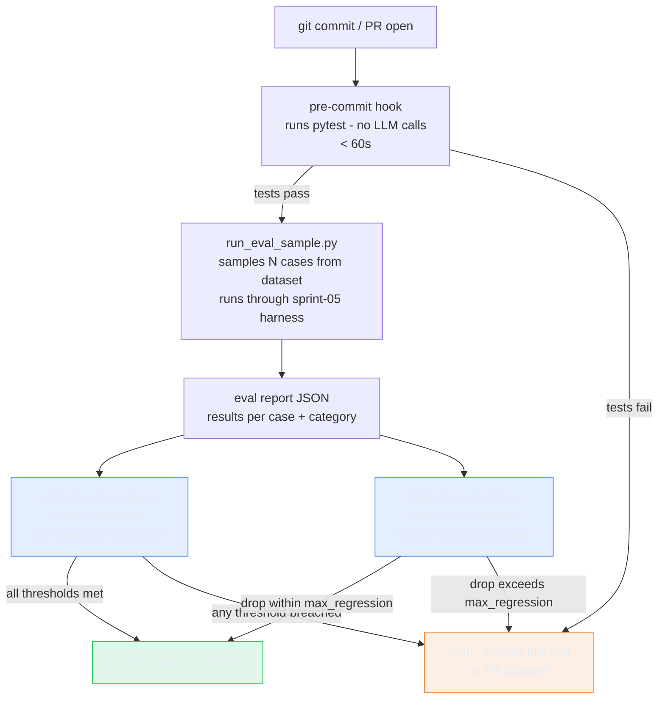

# The Eval Gate: Gating Prompt Changes Like You Gate Code Changes

> **TL;DR:** Unit tests catch code regressions. They do not catch prompt regressions. I wired Conductor's eval dataset into a CI gate - pass rate becomes a blocking check, categories get independent thresholds, and the first run caught a real IEEE 754 bug before any CI push.

## What I Wanted to Test

Whether a pass-rate eval gate can catch regressions that unit tests miss, and whether the gate itself avoids false negatives - specifically:

- A prompt rewrite that silently narrows Conductor's troubleshooting scope should fail the gate
- A 3% regression exactly at the boundary should pass (not fire by accident)
- A report where overall is 91.4% but one category is 70% should fail the gate

The hypothesis: if the gate passes when a threshold is breached, the gate is broken. If the gate fires when no threshold is breached, developers learn to ignore it. Both failure modes are fatal.

## Why This Matters

Conductor's behavior lives in two places: code and prompts. Unit tests cover the code side. But a prompt rewrite that removes a troubleshooting pattern, or a model bump that shifts how Conductor handles ambiguous questions, won't show up in any unit test. Without a gate, every prompt change is "ship and hope."

The eval dataset from the eval bootstrap lab and the harness from the memory lab already exist. The missing piece was wiring them into something that blocks before a bad prompt ships.

## Architecture



**Design principle:** Scripts are the primary interface. The GitHub Actions workflow calls the same scripts. If a gate can't be validated locally, it doesn't belong in this lab.

## Implementation

Four scripts + one workflow:

**`check_eval_gate.py`** reads an eval report JSON, checks overall pass rate against a threshold, then checks each required category independently. Exits 0 if all gates pass, exits 1 if any gate fails. The `--categories` flag takes `name:threshold` pairs.

**`regression_check.py`** compares current report to a stored baseline JSON. If the drop exceeds `max_regression`, it exits 1 and names the specific cases that regressed - not just the delta percentage. "Pass rate dropped 8.6%" is a metric. "These three troubleshooting cases broke" is actionable.

**`run_eval_sample.py`** samples N random cases from the YAML dataset and runs them through the sprint-05 harness via subprocess. No cross-sprint imports - subprocess is the boundary.

**`install_hooks.sh`** installs a pre-commit hook that runs `pytest tests/` only. No LLM calls. Completes in under 60 seconds (0.02s in practice).

**`.github/workflows/agent-eval.yml`** is a thin scheduler: unit tests every commit, eval sample on PRs, full suite on merge. It calls the scripts. No gate logic lives in the workflow YAML.

## Tests I Ran

17 tests, all deterministic, no LLM calls. Completed in 0.02s.

The test that caught the real bug:

```python
def test_passes_at_exact_boundary(self):
    """89% → 86% with max_regression=0.03 should PASS (not fire)."""
    result = check_regression(
        current_rate=0.86,
        baseline_rate=0.89,
        max_regression=0.03,
    )
    assert result is True
```

This test failed on the first run.

## What Broke

### Float precision at the boundary

The naive boundary condition:

```python
if delta < -max_regression:
    return False
```

In IEEE 754: `0.89 - 0.86 = -0.030000000000000002`. That is technically less than `-0.03`. The condition fired at exactly the boundary - a drop of exactly 3% returned "regression detected" when it should have returned "within tolerance."

The fix:

```python
if delta < -(max_regression + 1e-9):
    return False
```

Caught by `test_passes_at_exact_boundary` before any code ran in CI. If there was no test for this exact boundary condition, the bug would have been found the first time someone ran a clean eval run that happened to land on the 3% threshold.

The lesson: every documented boundary condition needs a test. "Exactly at the threshold should pass" is a boundary condition. It needs a test that exercises it with actual float arithmetic, not a mental model of how subtraction works.

### Missing hooks directory

`install_hooks.sh` failed on first run with "No such file or directory". `.git/hooks/` doesn't exist by default in a repo that has never had hooks installed. Real install scripts fail on edge cases that tutorials skip. The fix was `mkdir -p "$HOOKS_DIR"` before writing the hook file.

## What Worked

**The category masking demo is the best argument for per-category thresholds:**

```
$ python scripts/check_eval_gate.py \
    --report results/fixture-regression.json \
    --threshold 0.75 \
    --categories troubleshooting:0.90

Overall:  91.4% (threshold: 75.0%)  [PASS]

Per-category breakdown:
  knowledge_qa       100.0%  (9/9)   threshold: 75.0%  [PASS]
  onboarding         100.0%  (7/7)   threshold: 75.0%  [PASS]
  setup              100.0%  (9/9)   threshold: 75.0%  [PASS]
  troubleshooting     70.0%  (7/10)  threshold: 90.0%  [FAIL]

GATE: FAIL - one or more thresholds not met
exit: 1
```

Without per-category thresholds, this PR merges. Troubleshooting is Conductor's most critical mode - the one users rely on when something is already broken. A 30% failure rate in that category, masked by 100% in three others, is not a 91.4% pass rate in any meaningful sense. The aggregate number actively misleads.

**The regression checker names cases:**

```
Regressed cases (3):
  - troubleshooting-001: Getting 403 on BigQuery connector
  - troubleshooting-002: Connection times out after 30s
  - troubleshooting-003: Sync completed but no data appeared
```

These are the inputs that produced wrong answers. When a CI gate fires, the developer needs to know where to look. A drop percentage tells them something degraded. Named cases tell them what to fix.

## What I Learned

**Unit tests and eval gates measure different things.** Unit tests verify that the code does what you wrote. Eval gates verify that the agent behaves as intended. You need both. Passing one says nothing about the other.

**Scripts-first is the inversion worth keeping.** The workflow calls the scripts. The scripts are the product. Every check CI runs is also runnable locally - the pre-commit hook completes in 0.02s, and the gate and regression scripts are plain Python invocations with no CI dependency. The common alternative - baking gate logic into workflow YAML - means debug cycles cost a CI push each.

**Per-category thresholds are not optional polish.** A single aggregate number can hide a critical category failure. The masking case above - 91.4% overall, 70% troubleshooting - is not a contrived example. It is what happens when a prompt change fixes three easy categories and breaks one hard one. The gate needs to know which categories can't fail.

**Regression output is a signal, not a number.** The value of the regression checker is not that it reports a percentage drop. It is that it names the specific cases that regressed. That is the difference between "something broke" and "here is what to look at."

## Evidence

| Artifact | What It Shows |
|----------|---------------|
| Gate exits 1 on all-fail fixture | Threshold enforcement working |
| Gate exits 0 on all-pass fixture | No false positives on clean data |
| Category masking demo (91.4% overall, 70% troubleshooting) | Per-category thresholds catch what aggregate masks |
| Regression fires, names 3 cases with their inputs | Output is actionable, not just a delta |
| Boundary case: 89% to 86%, max_regression=0.03 - exits 0 | Epsilon fix holds at exact boundary |
| Pre-commit hook: 17 tests pass in 0.02s | Hook runs, is fast, blocks only on failure |

## Code

[conductor/sprint-05a-cicd-eval-gate](https://github.com/fidelKE/agent-build-log/tree/main/conductor/sprint-05a-cicd-eval-gate)

## What's Next

The skills lab - building Conductor's capabilities as structured skills with structural, behavioral, and triggering validation. Before skills can be validated, there has to be a gate to run the validation through. This lab builds that gate.

---

If you're running evals on an agent project, how do you decide what threshold is "good enough" to merge? Do you use a single number, per-category thresholds, or something else - and how did you arrive at it?
