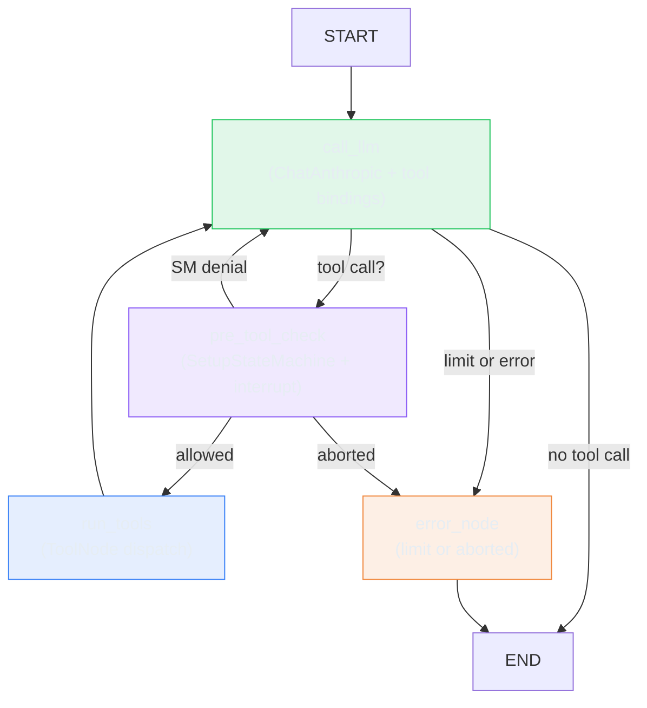

# LangGraph: What You Get When You Own the Graph

> **TL;DR:** I ran Conductor on LangGraph - the framework where you draw the topology yourself. It removed 80 lines of loop boilerplate and gave me SQLite checkpointing for free. The first thing I hit was a `TypeError` at compile time: `SqliteSaver.from_conn_string` is a context manager in v3+. This is the baseline for the framework comparison - Labs 6b and 6c progressively hide this graph.

## What I Wanted to Test

I had a working agent harness: a while loop, a tool dispatcher, a session store, a SetupStateMachine for sequencing connector steps, and a `PreToolUse` hook for human-in-the-loop approval. It worked. The question was whether replacing that loop with a LangGraph graph would preserve behavior while adding checkpointing and HITL as first-class primitives.

I also wanted to know whether LangGraph's progressive disclosure story for skills (a `load_skill` @tool) could replace the Claude Agent SDK's built-in lazy loading.

## Why This Matters

The hand-rolled loop had one big problem: it didn't survive process death. If the agent was mid-task and the process was killed, all state was gone. SQLite checkpointing solves that, but writing it yourself means writing schema management, serialization, and a resume protocol. LangGraph's checkpointer handles all of it.

The second problem was HITL. The prior lab's `PermissionRequest` hook was framework-specific. `interrupt()` in LangGraph is an explicit primitive - any node can pause, checkpoint full state, and wait for human input before resuming.

## Architecture



The graph has four nodes. `call_llm` invokes the model and returns an `AIMessage` with optional tool calls. `pre_tool_check` gates every tool call: the SetupStateMachine checks sequence (read before validate, validate before write) and `interrupt()` fires for the config-write tool in Setup mode. `run_tools` dispatches all tool calls and advances the state machine. `error_node` handles iteration limit and rejected approval.

The back-edge from `run_tools` to `call_llm` is the ReAct cycle. The iteration counter in `ConductorState` enforces `MAX_TURNS = 8` - a conditional edge routes to `error_node` instead of looping forever.

```python
class ConductorState(TypedDict):
    messages: Annotated[list[AnyMessage], add_messages]
    iteration_count: int
    status: str   # "running" | "completed" | "limit_reached" | "aborted" | "error"
    mode: str
    session_id: str
    user_id: str
    setup_sm_state: str   # serialized SetupStateMachine.state.value
    hitl_pending: bool    # True while interrupt() is active
```

All session state lives in the TypedDict. The SetupStateMachine state is serialized as a string (`"idle"`, `"read"`, `"validate"`, `"write"`) and reconstructed in each node that needs it. This keeps the state machine logic in Python and the checkpoint in LangGraph - no custom serializers.

## Implementation

### load_skill: replacing lazy loading without the SDK

The prior lab used the Claude Agent SDK's built-in skill lazy loading - the SDK only sends skill content to the model when it matches a trigger. LangGraph has no equivalent.

The replacement is a `@tool`-decorated function that reads the SKILL.md body on demand:

```python
@tool
def load_skill(skill_name: str) -> str:
    """Load the full instructions for a registered skill by name."""
    if skill_name not in REGISTERED_SKILLS:
        return f"Unknown skill: {skill_name!r}. Available: {sorted(REGISTERED_SKILLS)}"
    skill_path = _SKILLS_ROOT / skill_name / "SKILL.md"
    if not skill_path.exists():
        return f"Skill {skill_name!r} not found at {skill_path}"
    content = skill_path.read_text()
    # Strip YAML frontmatter
    if content.startswith("---"):
        parts = content.split("---", 2)
        if len(parts) >= 3:
            return parts[2].strip()
    return content
```

Zero startup token cost. The agent calls `load_skill("conductor-troubleshoot-connector")` when it needs the skill instructions. The content enters context only at that point. The trade-off: the model must know to call `load_skill` before using the skill - which means the system prompt explains the pattern. That's a few tokens at startup vs. skill content at trigger time.

### HITL with interrupt()

In the prior lab, HITL was a `PermissionRequest` hook in the Claude Agent SDK. In LangGraph, `interrupt()` is called inside a node:

```python
def pre_tool_check(state: ConductorState) -> dict:
    ...
    if mode == "setup" and tool_name in HITL_TOOLS:
        approval_request = {
            "tool_name": tool_name,
            "connector_id": tc["args"].get("connector_id", "unknown"),
            "fields": list(tc["args"].get("config_patch", {}).keys()),
        }
        human_input = interrupt(approval_request)   # pauses here, full state checkpointed

        approved = (
            human_input.get("decision") == "allow"
            if isinstance(human_input, dict)
            else str(human_input).strip().lower() == "y"
        )
        if not approved:
            denial = ToolMessage(
                tool_call_id=tc["id"],
                content=json.dumps({"error": "User rejected the configuration write."}),
            )
            return {"messages": [denial], "status": "aborted"}
```

`interrupt()` throws a `GraphInterrupt` exception internally. LangGraph catches it, checkpoints state, and surfaces it to the caller. Resuming is `graph.invoke(None, config=config)` after the human has responded. The full state is restored from SQLite - the node resumes from exactly after the `interrupt()` call.

### SQLite checkpointing: the API changed

This is where the first build failure hit.

The documented usage was `SqliteSaver.from_conn_string(db_path)`. That returns a `BaseCheckpointSaver` directly in older versions. In `langgraph-checkpoint-sqlite` v3+, it returns a `contextlib._GeneratorContextManager`. Passing that to `builder.compile(checkpointer=...)` raises:

```
TypeError: Invalid checkpointer provided. Expected an instance of
`BaseCheckpointSaver`, `True`, `False`, or `None`.
Received _GeneratorContextManager.
```

The fix: own the connection directly.

```python
_conn = sqlite3.connect(db_path, check_same_thread=False)
checkpointer = SqliteSaver(_conn)
```

This constructs a concrete `BaseCheckpointSaver`, owns the connection lifetime, and lets the caller close it via `checkpointer.conn.close()`. The context manager pattern is cleaner for short-lived use, but when the graph and checkpointer need to outlive a single `with` block, direct construction is the right call.

### Pydantic models from JSON Schema: the args-schema problem

LangGraph's `ToolNode` expects LangChain `BaseTool` objects. The existing tools were defined as JSON Schema dicts (for MCP compatibility). Converting them required `StructuredTool.from_function` with an explicit `args_schema`.

Without `args_schema`, LangChain infers a schema that wraps everything in a `tool_input` field - kwargs are lost. The fix: generate a Pydantic model from the JSON Schema at build time.

```python
_JSON_TYPE_MAP = {"string": str, "integer": int, "boolean": bool, "number": float, "object": dict, "array": list}

def _pydantic_from_schema(name: str, input_schema: dict):
    props = input_schema.get("properties", {})
    required = set(input_schema.get("required", []))
    fields = {}
    for field_name, spec in props.items():
        typ = _JSON_TYPE_MAP.get(spec.get("type", "string"), str)
        fields[field_name] = (typ, ...) if field_name in required else (typ, spec.get("default", None))
    return create_model(name, **fields)
```

`create_model` from pydantic generates a concrete model class at runtime. `StructuredTool.from_function(args_schema=pydantic_model)` binds it. Tool calls go through correctly.

## Tests I Ran

32 tests across six categories: structural eval coverage, checkpoint recovery, HITL/state machine, `load_skill`, connector tools, and BOM consistency. 32 passed, 0 skipped.

The test that caught a real bug:

```python
def test_build_graph_returns_compiled_and_checkpointer(self):
    with tempfile.NamedTemporaryFile(suffix=".db", delete=False) as f:
        db_path = f.name
    logger = _make_mock_logger()
    with patch("src.graph.ChatAnthropic"):
        graph, checkpointer = build_graph(
            tools=[],
            structured_logger=logger,
            db_path=db_path,
        )
    assert graph is not None
    assert checkpointer is not None
```

This is what surfaced the `_GeneratorContextManager` error. The test doesn't call the LLM - it patches `ChatAnthropic` - so it runs without credentials. But it calls `build_graph` and `builder.compile()`, which is where the checkpointer type is validated.

## What Worked

- Graph topology mapped cleanly to the hand-rolled loop: `call_llm` - `pre_tool_check` - `run_tools` - back-edge. No loss of behavior.
- SetupStateMachine serialized as a string value in `ConductorState.setup_sm_state` - no custom serializer, no LangGraph extension. The state machine is reconstructed per-node from the string.
- `load_skill` works as a progressive disclosure replacement. The agent calls it on demand; no SDK dependency; zero startup cost.
- Session isolation: `thread_id = session_id` enforced in config. Two sessions cannot share state.
- `interrupt()` is simpler than a `PermissionRequest` hook. It's a plain function call in a node - no hook registration, no hook matching rules.

## What Broke

**`SqliteSaver.from_conn_string` returning a context manager.**

`SqliteSaver.from_conn_string(db_path)` was documented as returning a saver instance. In v3+, it returns a context manager. LangGraph's `compile()` validates the checkpointer type and raises `TypeError` on a `_GeneratorContextManager`.

Found by: first test run with `test_build_graph_returns_compiled_and_checkpointer`. Fixed by switching to direct construction: `SqliteSaver(sqlite3.connect(db_path, check_same_thread=False))`.

**`Command` in node return type annotation.**

`pre_tool_check` had `dict | Command` as its return annotation. `Command` was removed from imports in a cleanup pass but the annotation wasn't updated. Python doesn't evaluate type annotations at runtime by default, so this didn't raise until a `NameError` would have occurred at annotation inspection time. Fixed to `dict` - node functions that route via conditional edges don't use `Command`.

**Session resume: "Received multiple non-consecutive system messages."**

When resuming an existing session, the code was passing the full `initial_state` (including a fresh `SystemMessage`) on every `graph.invoke()` call. On the first turn this was correct. On resume, the SQLite checkpoint already contained the prior `SystemMessage`. Appending a second one caused the Anthropic API to reject with: `multiple non-consecutive system messages`.

The fix is a one-line check before building the invoke input:

```python
existing_checkpoint = graph.get_state(config)
if existing_checkpoint and existing_checkpoint.values:
    invoke_input = {"messages": [HumanMessage(content=user_message)], "status": "running"}
else:
    invoke_input = {  # fresh session - full initial state
        "messages": [SystemMessage(content=system_prompt), HumanMessage(content=user_message)],
        ...
    }
```

What made it hard to catch: the first turn always worked. The failure only appeared on the second turn of the same session, which wasn't in the unit test suite (tests construct fresh graphs). The symptom (API error) pointed at the Anthropic API, not at LangGraph's state accumulation. The actual cause was the checkpointer silently appending to the existing message list on every invoke.

Lesson: when using `graph.invoke()` with a checkpointer, always check `graph.get_state(config)` first. The checkpointer accumulates state - it does not reset on each call.

## What I Learned

1. **Check the package changelog before using a factory method.** `from_conn_string` being a context manager in v3 wasn't in the top-level docs I checked. One grep of the source would have caught it before the first run. For packages with active development (LangGraph releases frequently), assume the API changed and verify.

2. **LangGraph routing lives in edges, not nodes.** The `Command` type is for nodes that need to explicitly control routing with data (like `Command(goto="other_node", update={"key": val})`). Nodes that just return state updates and let conditional edges decide the next step - which is most nodes - should return `dict`. The `Command` annotation was a leftover from a design that was never needed.

3. **`interrupt()` is as simple as it looks.** It's a function call. The complexity is on the caller side - the caller needs to catch `GraphInterrupt`, surface the approval payload to the human, collect the response, and call `graph.invoke(None, config=config)` to resume. The node itself is clean. Compared to hook-based HITL (register a hook, define a matcher, handle the callback), `interrupt()` is dramatically simpler.

4. **Progressive disclosure without SDK lazy loading costs a prompt description.** The system prompt must explain that `load_skill` exists and when to call it. The SDK's trigger-based lazy loading handles this automatically from the SKILL.md metadata. The `@tool` approach trades a few prompt tokens at startup for zero dependency on the SDK.

5. **Typed state dicts are better than arbitrary dicts for checkpointing.** The TypedDict forced me to name every piece of session state explicitly. When something broke, the state shape was visible. The `add_messages` reducer on `messages` handles list appending automatically - no manual concatenation.

## Evidence

| Artifact | What It Shows |
|----------|---------------|
| 32/32 unit tests passing | Graph topology, checkpointing, HITL, load_skill, connector tools, and BOM consistency all verified without live LLM |
| `SqliteSaver` direct construction | Checkpoint file created at test-time (confirmed by `test_sqlite_checkpoint_file_created`) |
| `load_skill` strips frontmatter | Body-only content confirmed (`test_load_skill_strips_frontmatter`) |
| SetupStateMachine 4 sequence tests | Out-of-order tool calls blocked, full sequence passes |
| `checkpointer.list()` present | Rollback to prior checkpoint confirmed available |

## Code

[conductor/sprint-06a-langgraph](https://github.com/fidelKE/agent-build-log/tree/main/conductor/sprint-06a-langgraph)

## What I'd Do Differently

**Check the installed package's source before using any factory method.** The `SqliteSaver.from_conn_string` issue cost a debugging session that a two-minute source read would have avoided. The docs I checked were out of date. For packages with active release cycles, the right move is to grep the installed source (`find .venv -name "*.py" | xargs grep "from_conn_string"`) before writing any persistence code - not after the first test fails.

**Test tool schema generation against a nested-field case first.** The Pydantic args-schema problem with `model_json_schema()` producing `$defs` blocks for nested models only shows up when you have a nested model. If I had called `json.dumps(tool.args_schema.model_json_schema(), indent=2)` on a single representative tool before wiring all of them, the `$defs` structure would have been visible immediately and the fix - flattening inline - would have been applied at the start instead of after all tools were wired.

**Start from "what does the agent need and when" for skill loading, not from the prior pattern.** The SDK injects skill content upfront via the trigger system. Replicating that as a `load_skill` tool took one iteration too long because the starting frame was "how does the SDK do it" rather than "what is the minimum the agent needs at invocation time." Starting from the agent's perspective - it needs the skill body only after it decides to invoke the skill - points directly to the on-demand `@tool` design. The SDK pattern is a reference, not a template.

## What's Next

Next is the same Conductor harness on LangChain's middle tier - `create_agent()`. The framework owns the graph but you own the middleware. The question: what do you lose when you stop drawing the topology yourself?

---

When you own the full graph topology and need to change a routing condition, how far does the edit spread - just the conditional edge, or does the state schema pull the nodes along with it? And when a framework's internal API changes between patch versions, at what point do you stop patching the adapter and start questioning whether the abstraction is worth the lock-in?
