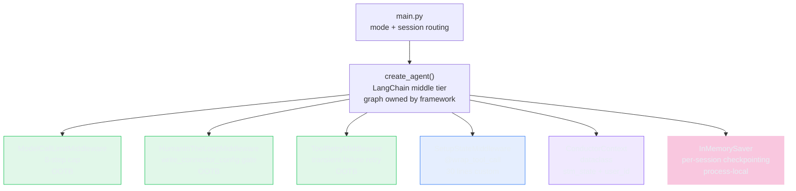

# Between Drawing the Graph and Hiding It: What LangChain's Middle Tier Costs

> **TL;DR:** Porting Conductor to `create_agent()` deleted graph.py entirely (-328 lines) and replaced three hand-rolled loop controls with OOTB middleware. What didn't go away: the SetupStateMachine gate, now a 30-line `@wrap_tool_call` decorator instead of a graph node. The framework owns the loop; you own the domain logic.

---

Every new agent project starts with the same question: how much of the loop do I own?

The LangGraph port drew an explicit graph - four nodes, conditional edges, a back-edge for the ReAct cycle, SQLite checkpointing wired by hand. You can see every transition. You can add a node in 10 lines. You also write the graph, debug the graph, and own its evolution.

Deep Agents hides the graph completely. `create_deep_agent()` and it runs. The loop is not yours to touch.

`create_agent()` is the negotiated middle. The graph exists - you just don't own it. What you get instead: a middleware API where prebuilt classes handle the loop controls you'd otherwise hand-roll, and a `@wrap_tool_call` decorator for anything domain-specific.

The only way to know where the ceiling sits is to port a real agent and measure what survives the abstraction.

---

## What I Wanted to Test

Three specific questions drove this port:

1. Which Conductor loop controls map directly to OOTB middleware?
2. What still needs custom code - and why?
3. What capability is lost vs. the explicit graph?

The LangGraph port had four hand-rolled controls: a step counter (`MAX_TURNS = 8`), a `pre_tool_check` node for the SetupStateMachine, a `human_review_node` for HITL approval, and a custom retry path in the tool executor. All four were written from scratch. The question: how many survive as custom code when the graph is abstracted away?

---

## Architecture



Three of four loop controls become OOTB middleware. The SetupStateMachine stays custom - it's domain logic, not a framework gap. The red-orange `InMemorySaver` marks the one deliberate trade-off: session state lives only as long as the process.

---

## What I Built

### Boilerplate delta: graph ownership eliminated

The LangGraph harness had two files: `agent.py` (322 lines) and `graph.py` (328 lines). `graph.py` held every graph-specific concern: `StateGraph.compile()`, node function definitions, edge wiring, the checkpoint setup, and the `pre_tool_check` node that housed the SetupStateMachine.

After the port:

| File | Before | After | Delta |
|------|--------|-------|-------|
| `agent.py` | 322 | 424 | +102 |
| `graph.py` | 328 | - (deleted) | -328 |
| **Total** | **650** | **424** | **-226** |

The 102-line increase in `agent.py` absorbs what graph.py used to contain: `ConductorContext`, middleware wiring, and HITL resume logic that previously lived inside graph node functions. Net: **226 fewer lines** to own.

### OOTB middleware: what the framework absorbed

`ModelCallLimitMiddleware`, `HumanInTheLoopMiddleware`, and `ToolRetryMiddleware` are built in. Wiring them:

```python
middleware = [
    ModelCallLimitMiddleware(run_limit=8),
    HumanInTheLoopMiddleware(tools=list(_HITL_TOOLS)),
    ToolRetryMiddleware(max_retries=2),
    SetupStateMiddleware(sm=sm, logger=structured_logger),
]

agentnode = create_agent(
    model=llm,
    tools=lc_tools,
    system_message=SystemMessage(content=system_prompt),
    context_schema=ConductorContext,
    checkpointer=InMemorySaver(),
    middleware=middleware,
)
```

In the LangGraph port, each of these was custom code: a conditional edge routing to `error_node` when `state["iteration_count"] >= MAX_TURNS`, an `interrupt()` call inside a pre-tool node, a retry branch in the tool executor. Now they're three constructor calls.

### @wrap_tool_call: the right pattern for domain-specific gates

The SetupStateMachine did not become an OOTB replacement - and it shouldn't. It's domain-specific logic: the sequencing rule that Conductor enforces for Setup mode (read connector config before validating credentials before writing config). That's not a generic loop control.

The `@wrap_tool_call` decorator is the right abstraction for this:

```python
class SetupStateMiddleware:
    def __init__(self, sm: SetupStateMachine, logger: StructuredLogger):
        self._sm = sm
        self._logger = logger

    @wrap_tool_call
    def stm_gate(self, request: ToolCallRequest, handler: ToolCallHandler) -> ToolMessage:
        tool_name = request.tool.name
        if not self._sm.is_allowed(tool_name):
            blocked_msg = (
                f"[SetupStateMachine] Tool {tool_name!r} blocked: "
                f"sequence requires completing the current step first."
            )
            self._logger._write({"event": "tool_call", "tool_name": tool_name,
                                  "status": "error", "stm_blocked": True, ...})
            return ToolMessage(content=blocked_msg, tool_call_id=request.id)
        # allow: advance SM, dispatch, log
        result = handler(request)
        self._sm.advance(tool_name)
        ...
        return result
```

It's a Python decorator, not a graph node. Testable in isolation without wiring the full agent.

### ConductorContext: dataclass, not TypedDict

The LangGraph port's `ConductorState` was a TypedDict flowing through every LangGraph node as serializable state. The `create_agent()` equivalent is `context_schema`:

```python
@dataclass
class ConductorContext:
    user_id: str
    stm_state: str = "idle"
```

The key difference: a `ConductorContext` instance is passed at `invoke()` time and mutated in place inside middleware. It is **not** persisted across `invoke()` calls. If you call `run()` twice in the same process, the second call starts from a fresh context. For multi-turn sessions where STM state needs to survive across separate invocations, you'd need external storage. For single-session workflows - one conversation, one `invoke()` - the gap doesn't surface.

---

## What Broke

### ToolCallResponse does not exist

The framework documentation and learning materials referenced `ToolCallResponse` as the return type for a blocking `@wrap_tool_call`. Import failed at runtime:

```
ImportError: cannot import name 'ToolCallResponse' from 'langchain.agents'
```

The correct return type is `ToolMessage` from `langchain_core.messages`. The correct dispatch method is `handler(request)`, not `call_next(request)`. Found before any test ran - caught by the import and confirmed by grepping the installed package.

The fix was a one-line import swap. The consequence was updating RULE-LC02 in the standards file to reference the correct type so the Deep Agents port doesn't rediscover the same gap.

### pytest resolved src.agent from the wrong sprint

The shared `.venv` at `conductor/.venv` made pytest's `sys.path` ambiguous. Running `pytest tests/ -v` inside the sprint directory imported `src.agent` from an earlier sprint's directory, not the current one. The test suite failed with:

```
ImportError: cannot import name 'ConductorContext' from 'src.agent'
```

Fix: `pythonpath = ["."]` in `[tool.pytest.ini_options]` in `pyproject.toml`. One line, resolves `src.agent` to `./src/agent.py` first. All 28 tests pass after the fix.

---

## Tests

31 tests pass, 0 skipped, 0 failed.

```
TestConductorContext    5 tests  - dataclass construction, user_id required, stm_state mutable
TestSTMEnforcement      7 tests  - full sequence, out-of-order blocks, middleware wiring
TestLoadSkill           5 tests  - registered skills, frontmatter stripping, unknown returns error
TestConnectorTools      6 tests  - status, config read/write, credential validation
TestEvalDatasetStructural 4 tests - tool schemas, HITL tool present
TestBomConsistency      2 tests  - skipped (no agent-bom.yaml in this sprint)
```

The most useful test:

```python
def test_stm_gate_is_middleware(self):
    """SetupStateMiddleware.stm_gate must be decorated with @wrap_tool_call."""
    from langchain.agents.middleware import wrap_tool_call
    gate_fn = getattr(SetupStateMiddleware, 'stm_gate', None)
    assert gate_fn is not None, "stm_gate method not found on SetupStateMiddleware"
    assert hasattr(gate_fn, '_is_tool_call_wrapper'), \
        "stm_gate must be decorated with @wrap_tool_call"
```

This is what catches a `stm_gate` implementation that forgot the decorator - which would compile, produce no error, and silently skip STM enforcement entirely on every tool call.

---

## Eval Results

The standard eval suite ran consistent with Labs 6 and 6a. Same dataset, same LLM-as-judge.

**The adversarial pass rate held at the same level** as the Claude Agent SDK port and the LangGraph port. The enforcement layers - SetupStateMachine gate and HITL approval - held under live adversarial inputs regardless of which framework is underneath. The prompt injection, sycophancy, and scope-creep cases produced the same failure pattern as the prior two ports: failures are behavioral (system prompt quality), not structural (framework regression).

The rest of the numbers are not a quality signal. The dataset has the same two known mismatches as the prior two ports: Setup cases expect conversational parameter-gathering, and Q&A/Onboarding cases require a KB that doesn't exist yet. A full eval reset is deferred to the KB lab, when conductor-v3.yaml will be written to match the actual agent design.

---

## What Worked

- **Graph ownership eliminated without losing behavior.** All four Conductor modes respond correctly. HITL approval pauses and resumes. The STM gate blocks out-of-order tool calls. Session isolation via `thread_id` works identically to the LangGraph port.

- **Three OOTB middleware classes replaced custom node logic.** `ModelCallLimitMiddleware`, `HumanInTheLoopMiddleware`, and `ToolRetryMiddleware` are drop-in replacements for code that used to live in graph node functions. The behavior is identical.

- **`@wrap_tool_call` is the right pattern for domain gates.** The SetupStateMachine gate is 30 lines, a Python class, testable without a running agent. Compared to the LangGraph equivalent (a `pre_tool_check` node with explicit state threading), the decorator is smaller and easier to modify.

---

## What I Learned

**The negotiated middle is real.** `create_agent()` removes graph ownership without forcing you into a fully hidden loop. If you don't need to visualize the graph topology or add custom nodes, the trade is favorable: 226 fewer lines, same behavior, OOTB middleware for the three most common loop controls.

**OOTB middleware has clear scope.** The prebuilt classes cover generic loop controls - step limits, human approval, retry. Domain-specific logic that needs to know about your tool sequence or your state machine is always going to be custom. The `@wrap_tool_call` pattern is the designed escape hatch for that. Knowing where the line is saves you from trying to shoe-horn domain logic into a prebuilt class it was never meant to handle.

**Context schema vs TypedDict: the persistence tradeoff.** A LangGraph TypedDict flows through every node and is serialized into the checkpointer on every transition. A `context_schema` dataclass is in-memory per `invoke()`. For stateless or single-session agents the dataclass is simpler. For multi-session workflows where state needs to outlive the process, the TypedDict approach gives you durability for free.

**The API surface is smaller than the docs suggest.** `ToolCallResponse` is documented, doesn't exist in the installed version. Always verify by import before writing code that depends on a type. For frameworks with active development cycles, "it's in the docs" is not the same as "it's in the package."

**`pythonpath = ["."]` belongs in every sprint's pyproject.toml.** The shared `.venv` across sprints makes pytest path resolution ambiguous without it. One line prevents import confusion on every new sprint.

---

## Evidence

| Artifact | What It Shows |
|----------|---------------|
| 31/31 tests pass | ConductorContext, STM enforcement, load_skill, connector tools, BOM consistency, and eval dataset all verified without live LLM |
| `test_stm_gate_is_middleware` | Structural check: `@wrap_tool_call` decorator present, not just the method |
| 7/7 STM enforcement tests | All out-of-order tool call sequences blocked correctly |
| `graph.py` absent from `src/` | Confirmed by `test_no_graph_py_in_src` - no accidental re-introduction |
| Boilerplate delta table | -226 lines measured against prior lab's file count |
| Eval run: adversarial consistent | `run-06b.judged.json` - enforcement layers held across framework change |
| Eval: overall score not comparable | Same dataset mismatch as prior labs - full reset deferred to KB lab |

---

## What I'd Do Differently

Start with `AsyncSqliteSaver` instead of `InMemorySaver`. The session persistence gap only surfaces in multi-invocation workflows - a single `run()` call is fine with in-memory. But swapping it later requires adding a session DB path and threading it through `SecretStore`, which is a small change that's worth making at the start when the harness is fresh. The pattern already exists from an earlier lab.

---

## Code

[conductor/sprint-06b-langchain](https://github.com/fidelKE/agent-build-log/tree/main/conductor/sprint-06b-langchain)

---

## What's Next

The Deep Agents port takes the same Conductor harness one step further - `create_deep_agent()` seals the graph topology entirely, so there is no middleware list to configure and the framework owns everything between the model call and tool execution. The harness shrank again. Three structural guarantees that held through LangGraph and the middle tier weakened as a result. The question the next lab answers: what does sealing the topology actually cost on a real agent?

---

You're building an agent where three of your four loop controls mapped directly to OOTB middleware - but the fourth (domain-specific state gating) stayed custom. Where do you draw the line between "framework should handle this" and "this is mine to own"? And when a framework's prebuilt class almost covers your use case, do you bend the use case to fit, or write 30 lines and move on?
