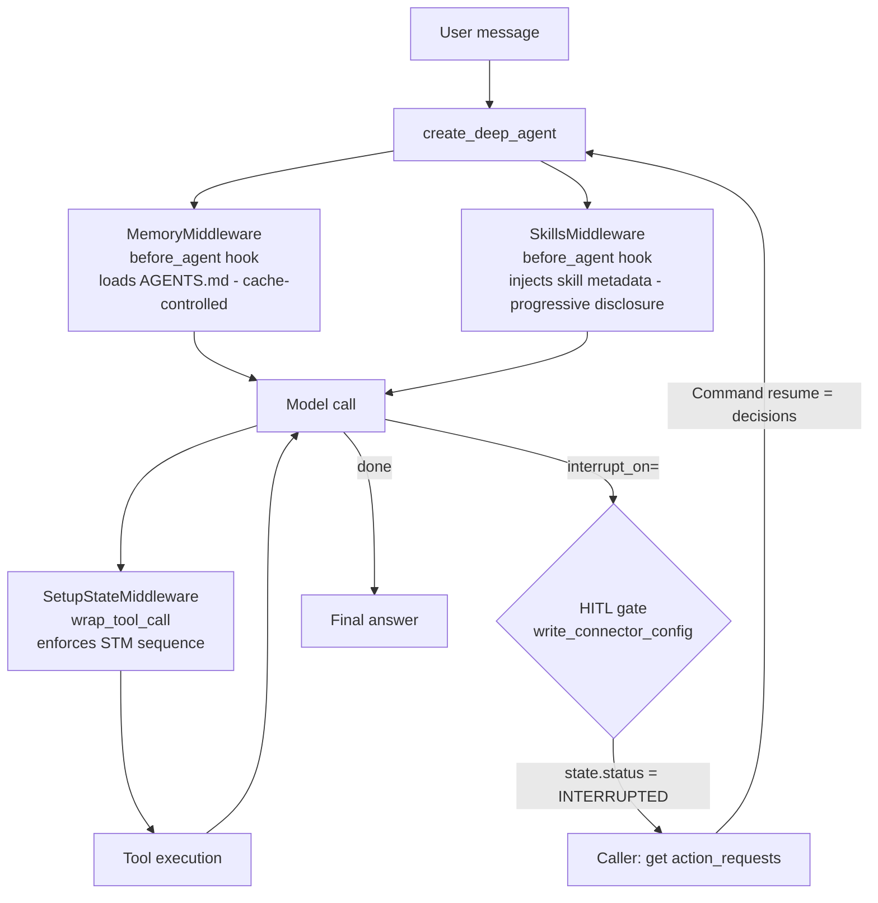

# Same Conductor, Sealed Topology: What You Give Up With Deep Agents

> **TL;DR:** The previous lab (LangChain `create_agent()`) already hid the loop. `create_deep_agent()` goes further - it seals the topology. Moving from LangChain `create_agent()` to `create_deep_agent()` cuts harness boilerplate by 4% - LangChain already captured most of the gain from dropping `graph.py` (35% vs. LangGraph). Three hand-rolled patterns (memory loading, step cap, skills wiring) were replaced by prebuilts. Three structural guarantees weakened: conditional routing moved from graph edges to model reasoning, HITL dropped from node-level to tool-level control, and the state machine lost its place in the graph checkpoint. None of these are framework bugs - they are the correct Deep Agents approach to each problem, and each comes with a lower structural guarantee than LangGraph. All three were already present in LangChain. Deep Agents inherits them. Every gap traces back to the same root cause: the framework owns the topology. Here is what that looks like when you port a real agent.

---

## What I Wanted to Test

The previous three ports built the same agent three different ways. The Claude Agent SDK used a hand-rolled ReAct loop. LangGraph used an explicit graph where every node and edge was mine to define. LangChain's `create_agent()` (the lab immediately before this one) hid the loop behind a factory function but still exposed the middleware list.

Deep Agents is the next step in that progression. `create_deep_agent()` wraps LangGraph behind a single factory function, provides a prebuilt middleware catalogue, and - crucially - compiles and seals the graph topology before returning it. The difference from `create_agent()` is not the loop being hidden. That was already true. The difference is that the graph is no longer accessible at all.

The hypothesis: going one step further than LangChain `create_agent()` will save some lines, and the ceilings LangChain already introduced will carry over - but sealing the topology entirely may add new ones on top.

## Why This Matters

Every framework in this space offers some version of this tradeoff: control versus convenience. The claim for opinionated frameworks is always "you don't need that control." The only way to evaluate that claim is to try to express a real agent's requirements through the abstraction and measure exactly where it holds and where it breaks.

---

## What I Built

A full port of Conductor to `create_deep_agent()`:

- All four capability modes (Setup, Troubleshooting, Q&A, Onboarding) through a single agent instance
- `SOUL.md` passed as `system_prompt=` - same file, same content, zero changes
- `AGENTS.md` loaded at session start via `MemoryMiddleware` (prebuilt - Anthropic prompt-cache control keeps the memory block cached across turns)
- `SkillsMiddleware` wired via `FilesystemBackend` pointing at the shared skills directory - progressive disclosure: metadata only upfront, full body read on demand via `read_file`
- `ModelCallLimitMiddleware(run_limit=8)` replacing the hand-rolled step counter
- `SetupStateMiddleware` enforcing the read-validate-write sequence via `wrap_tool_call`
- HITL wiring via `interrupt_on=` + `MemorySaver` checkpointer + `Command(resume=...)`
- Token cost measurement per query type feeding a later cost optimization baseline

The architecture in one diagram:



What is not in this diagram - and not in the file listing either - is `graph.py`. In the LangGraph port that was 328 lines of explicit node and edge definitions. Here it does not exist. The framework owns that layer.

---

## The Three Ceilings

These are capabilities LangGraph expresses structurally that neither LangChain `create_agent()` nor Deep Agents can match. Both later frameworks sealed the topology - LangChain by hiding graph construction behind a factory, Deep Agents by compiling and locking it entirely. The gaps listed here apply to both, but they are most visible in Deep Agents because `create_deep_agent()` makes the constraint explicit.

### 1. Per-mode conditional routing

In the LangGraph port, the graph had four conditional edges. The `route_by_mode()` function read the current mode from `ConductorState` and dispatched to a different node sequence - a troubleshooting query went through one path, a setup query through another. The structural routing meant mode behavior was enforced by the graph topology itself, not by model reasoning.

LangChain `create_agent()` does not expose `add_conditional_edges()` either - it also uses system prompt injection for mode routing. Deep Agents takes the same approach. In both cases, `create_deep_agent()` assembles and compiles the graph before returning it. What you get back is a `CompiledStateGraph` - there is no `add_node()`, `add_edge()`, or `add_conditional_edges()` API. The graph topology is fixed at construction time. Customization happens through `middleware=`, `tools=`, `system_prompt=`, and `interrupt_on=` parameters - all of which configure behavior within the sealed topology, not the topology itself.

In Deep Agents, conditional routing is replaced by system prompt injection: mode is passed as a block inside the system prompt at run time. The agent reads the mode block and adjusts its behavior accordingly. This is the correct Deep Agents approach - there is no other option when the topology is fixed. But the structural guarantee is weaker. With graph edges, mode was a hard constraint enforced before the model ran. With prompt injection, mode is a soft constraint: the agent reasons its way into the right behavior on every call. For Conductor's current needs this is sufficient. For an agent that needs mode-specific tools, different memory scopes per mode, or behavior the model should not be able to override, the gap is real.

**Verdict: topology ceiling, shared with LangChain.** LangChain `create_agent()` already used system prompt injection for routing - this ceiling was present in Lab 6b. Deep Agents inherits it unchanged.

**Why not just use dedicated agents per mode instead?** The more principled design is a router that dispatches to a SetupAgent, TroubleshootAgent, QAAgent, and OnboardingAgent - each with only the tools it needs, HITL only where it applies, the state machine only in Setup. With that architecture the model cannot accidentally call `write_connector_config` during troubleshooting because the tool simply does not exist in that agent. Prompt injection is the wrong enforcement mechanism for invariants.

The reason this lab does not do that is benchmark integrity. Across the five framework ports in this series - Claude Agent SDK, LangGraph, LangChain `create_agent()`, Deep Agents, and Google ADK - the experiment is the same agent ported across the same five frameworks. Switching to multi-agent mid-series would break the comparison - you would no longer know whether differences in eval pass rate come from the framework or the architecture. Prompt injection is the acceptable cost of keeping the benchmark clean.

The multi-agent design is the target for the multi-agent orchestration lab later in the series. That lab covers supervisor/worker patterns and A2A protocol - dedicated mode agents with a supervisor that routes and hands off between them is the natural experiment there.

**The harder question: what about cross-mode handoffs?** A real user flow often crosses mode boundaries. A troubleshooting session that finds a misconfigured field should hand off to Setup to fix it - not just report the problem. With a single agent and prompt injection, that handoff is implicit: the model reasons that the mode should shift. With dedicated agents, it is explicit: the TroubleshootAgent returns a structured finding, the router decides whether to invoke the SetupAgent with that context, and the SetupAgent receives it as input rather than reconstructing it from a conversation thread. The A2A handoff preserves state - the troubleshooting diagnosis is the setup agent's starting context, not a message for it to re-parse. This is also covered in the multi-agent lab, where the Troubleshoot-to-Setup handoff is a concrete experiment case.

### 2. HITL at node level vs tool level

In the LangGraph port, HITL was a first-class graph concept. A `human_review_node` was an explicit node wired with incoming and outgoing edges. When the agent reached a review point, execution paused at that node. The caller had full control over which node triggered the pause and which node handled the resume - including branching differently based on the outcome.

LangChain `create_agent()` moved HITL to middleware: `HumanInTheLoopMiddleware(interrupt_on={...})` is added to the middleware list. It is tool-level - you name the tool, the middleware intercepts before the call, the caller handles the interrupt response. Deep Agents exposes the same capability differently: `interrupt_on=` and `checkpointer=` are parameters on `create_deep_agent()` directly rather than middleware entries. The mechanism is similar. The gap vs. LangGraph is the same in both: framework-level HITL cannot express branching based on the human decision. The agent has to interpret the decision in the next step via reasoning, not via a conditional edge.

In Deep Agents specifically, `interrupt_on=` is the intended HITL API - not a workaround. You name a tool, the framework pauses before calling it, and resume re-enters the agent at the same tool invocation point. The framework owns the pause and resume nodes. The capability gap is branching: when the review decision needs to route execution differently based on outcome - approve continues, reject goes elsewhere - tool-level HITL cannot express that structurally.

For Conductor's escalation case (block `write_connector_config` until human approves or rejects), tool-level control is sufficient. The gap only becomes a real constraint when you need the graph to take structurally different paths depending on the human decision.

One behavior worth understanding: without `checkpointer=` wired to the agent, the resume path fails silently. The second `invoke(Command(resume=...))` completes without error but produces no output. More on this in "What Failed" below.

```python
# All three required - none optional
agent = create_deep_agent(
    ...
    interrupt_on={"write_connector_config": {"allowed_decisions": ["approve", "edit", "reject"]}},
    checkpointer=_CHECKPOINTER,  # MemorySaver - persists graph state between the two invokes
)

# thread_id must be identical on both invoke() calls
hitl_config = {"configurable": {"thread_id": session_id}}

# First call - hits the interrupt
result = agent.invoke(
    {"messages": [HumanMessage(content=user_message)]},
    config=hitl_config,
    version="v2",
)
# result.interrupts[0].value contains the action_requests

# Second call - resumes after human decision
result = agent.invoke(
    Command(resume={"decisions": [{"type": "approve"}]}),
    config=hitl_config,
    version="v2",
)
```

**Verdict: available, tool-level.** Node-level control - choosing which nodes pause and resume, branching on the decision - requires LangGraph directly.

### 3. State machine state has no home in the graph

In the LangGraph port, the setup state machine lived in `ConductorState` - the TypedDict that flowed through every node as ordinary graph state. Any node could read the current machine state, any node could write the next state, and the graph maintained the full transition history as part of the run record. The state machine was observable and persisted automatically with the rest of the checkpoint.

LangChain `create_agent()` also lacks native TypedDict graph state for middleware enforcement. The STM state was carried in a `ConductorContext` dataclass and passed via `context_schema=` - still external to the graph, still a per-invocation mutable container. Deep Agents exposes `state_schema=` to add custom fields to graph state, but middleware hooks (`wrap_tool_call`) only receive the current tool call and a `next_fn` - graph state does not flow through them. The enforcement mechanism (middleware) cannot read or write those custom fields. The result is the same in both frameworks: the state machine has to be threaded as an external mutable container passed to the middleware constructor at agent construction time - not because custom state is unavailable, but because the middleware scope does not include it.

```python
sm = SetupStateMachine()
sm_middleware = SetupStateMiddleware(sm, structured_logger)
# sm is external mutable state - not graph state, not serialized between sessions
```

The enforcement behavior is identical: out-of-sequence tool calls are blocked. What changes is observability. In the LangGraph port the state machine's current state was part of the graph's checkpoint record - it persisted across sessions automatically. LangChain `create_agent()` already lost this: the external container pattern introduced in Lab 6b has the same limitation. In the Deep Agents port it still lives in a Python object that does not survive between runs. The `sm_state` field in each `tool_call` log event captures the current state at dispatch time, but reconstructing the full transition history across sessions requires reading through the JSONL log rather than querying the checkpoint.

For a connector setup flow that spans multiple sessions (common in practice), this means the state machine resets on every new run. The log is the only audit trail.

**Verdict: middleware scope ceiling.** External mutable container is the correct approach when state belongs to enforcement logic that lives in middleware. The cost is observability: state machine transitions no longer live in the checkpoint record.

---

## Three Prebuilt Middlewares, Three Hand-Rolled Patterns Deleted

Before the ceiling findings: the middleware catalogue paid off.

The initial build had three hand-rolled patterns that should not have existed. After reviewing the prebuilt catalogue:

**`MemoryMiddleware` replaced a custom `BeforeAgentMiddleware` class.** The custom class loaded `AGENTS.md` into the system prompt at session start. `MemoryMiddleware` does the same job with one additional benefit: `add_cache_control=True` adds an Anthropic prompt-cache breakpoint on the memory block, keeping it cached across turns. Zero custom code.

**`ModelCallLimitMiddleware(run_limit=8)` replaced a hand-rolled step counter.** `create_deep_agent()` has no `max_iterations` parameter. The custom build was going to need a counter in `wrap_tool_call` to enforce the 8-step cap from RULE-AG02. The prebuilt handles it entirely.

**`SkillsMiddleware` worked - it just needed the right import path.** The initial build used `from deepagents import SkillsMiddleware` (wrong - not exported at the top-level package) and assumed the constructor took a manifest dict. The actual constructor:

```python
from deepagents.middleware import SkillsMiddleware   # correct submodule
from deepagents.backends.filesystem import FilesystemBackend

backend = FilesystemBackend(root_dir=str(skills_root), virtual_mode=False)
middleware = SkillsMiddleware(
    backend=backend,
    sources=[(str(skills_root), "Conductor")],
)
```

The behavior is better than expected. `SkillsMiddleware` does not inject the full SKILL.md body at session start - it injects skill name and description (metadata) only. The agent calls `read_file` on the skill path when it decides a skill applies. Zero bulk startup token cost.

The contrast across the four ports is now sharper:
- Claude Agent SDK: `--skill` flag, full body injected, explicit documentation
- LangGraph: `load_skill @tool`, full body read on demand by the agent
- LangChain `create_agent()`: `load_skill @tool`, same pattern as LangGraph (carried forward unchanged)
- Deep Agents: `SkillsMiddleware`, metadata only upfront, body on demand via `read_file`

Deep Agents' skills approach is the most token-efficient of the four. That was a surprise.

---

## The Numbers

| Concern | Claude Agent SDK | LangGraph | LangChain `create_agent()` | Deep Agents |
|---------|-------------------|--------------------|--------------------------|---------------------|
| Agent harness | `agent.py`: 397 lines | `agent.py` 322 + `graph.py` 328 = 650 | `agent.py`: 442 lines (no `graph.py`) | `agent.py`: 426 lines (no `graph.py`) |
| Skills wiring | SDK `--skill` flag, full body injected | `load_skill @tool`, full body on demand | `load_skill @tool`, full body on demand (same as LangGraph) | `SkillsMiddleware` via `FilesystemBackend` - metadata upfront, body on demand |
| Memory loading | custom `before_agent` hook | custom `BeforeAgentMiddleware` | custom `BeforeAgentMiddleware` (carried forward) | `MemoryMiddleware` (prebuilt, cache-controlled) |
| Step cap | RULE-AG02 custom counter | RULE-AG02 custom counter | `ModelCallLimitMiddleware(run_limit=8)` (prebuilt) | `ModelCallLimitMiddleware(run_limit=8)` (prebuilt) |
| HITL | `PreToolUse` hook | `interrupt()` + graph edge | `HumanInTheLoopMiddleware(interrupt_on=...)` in middleware list | `interrupt_on=` + `checkpointer=` + `Command(resume=...)` |
| Mode routing | system prompt | conditional graph edges | system prompt injection only | system prompt injection only |

LangGraph harness total: 650 lines. LangChain `create_agent()` total: 442 lines (-208 lines, -32% vs LangGraph). Deep Agents total: 426 lines. Delta 6b -> 6c: **-16 lines (-4%)**. Delta 6a -> 6c: **-224 lines (-35%)**.

The 35% reduction vs LangGraph comes entirely from deleting `graph.py`. LangChain `create_agent()` already captured most of that gain - the move from LangChain to Deep Agents is a -4% delta, not a 35% one. The rest of `agent.py` grew slightly in Deep Agents to absorb the middleware classes and the HITL wiring.

---

## What Failed

**HITL resume path silently returns null without a checkpointer**

Without `checkpointer=` wired to the agent, calling `invoke(Command(resume=...), config=hitl_config)` completes without error but produces no output. The run state has no final answer and no `hitl_interrupt` event appears in the JSONL log. The `token_cost` event is still written, but `message_count` is 0. The framework gives no warning at construction time that `checkpointer=` is required for interrupt/resume to work.

This was visible only by running an actual interrupt flow and reading the log. Once `checkpointer=` was added, the full interrupt - resume sequence produced a `hitl_interrupt` event on the first invoke and a `hitl_resume` event on the second, with `final_answer` populated.

The broader lesson: when an interrupt/resume pattern produces no output and no error, the first thing to check is whether graph state can actually persist between the two calls - not whether the feature is supported.

**Skills progressive disclosure changed the token cost assumption**

The initial assumption was that `SkillsMiddleware` would inject the full `SKILL.md` body into the context at session start, making the token cost of sessions with skills active measurably higher. Reading the `token_cost` logs showed the input token count for sessions with skills active was nearly identical to sessions without - the difference was within noise.

The framework injects skill name and description only. The agent reads the full body via `read_file` when it decides a skill applies. This is better behavior than the original assumption (zero bulk startup token cost), but it changed the basis of the skills comparison across the three ports. The difference between the LangGraph port's manual `load_skill` tool and Deep Agents native skills is deferred vs. deferred loading - both read on demand. The contrast is now with the Claude Agent SDK port, where the full body was injected at session start.

A meaningful trigger rate comparison across the three skills mechanisms requires a controlled setup with the same 20 queries run against each framework under identical conditions. That measurement is the experiment for the cross-provider skills lab later in this series, where all three mechanisms get a fair side-by-side with numbers. The qualitative finding here - that `SkillsMiddleware` progressive disclosure changes the token cost basis - is the input that framing will need.

---

## Tests

49 / 49 passing. Two HITL tests, four skills tests, and four eval dataset structural tests cover the new wiring:

```python
def test_hitl_tools_dict_not_set(self):
    # RULE-DA04: _HITL_TOOLS is a dict (interrupt_on= shape), not a set
    assert isinstance(agent_module._HITL_TOOLS, dict)
    assert "write_connector_config" in agent_module._HITL_TOOLS

def test_checkpointer_module_level(self):
    # RULE-DA04: _CHECKPOINTER is MemorySaver - required for interrupt/resume
    assert isinstance(agent_module._CHECKPOINTER, MemorySaver)

def test_make_skills_middleware_callable(self):
    assert callable(make_skills_middleware)

def test_make_skills_middleware_returns_middleware_or_none(self):
    result = make_skills_middleware()
    if result is not None:
        from deepagents.middleware import SkillsMiddleware
        assert isinstance(result, SkillsMiddleware)

def test_get_skill_manifest_not_in_skills_py(self):
    # get_skill_manifest() replaced by make_skills_middleware() - manifest approach was wrong
    assert not hasattr(skills_module, "get_skill_manifest")
```

The structural compliance scan passes for all nine rules including RULE-DA04.

---

## What I Learned

**The abstraction ceiling is a topology problem, not an API problem.** Deep Agents is not missing features. It made a deliberate design decision to own the graph. Every capability loss in this lab traces back to one cause: no way to add a node, rewire an edge, or thread arbitrary state through the run. If your agent needs those things, you need LangGraph directly.

**Check the prebuilt catalogue before writing custom middleware.** Three hand-rolled patterns - custom memory loader, custom step cap, custom skill wiring - each had a prebuilt replacement. The prebuilts are shorter and better: `MemoryMiddleware` adds prompt-cache control, `ModelCallLimitMiddleware` handles exit behavior, `SkillsMiddleware` uses progressive disclosure instead of bulk injection. Looking at the catalogue before the build would have saved those three custom implementations.

**Middleware is the escape hatch with a scope limit.** `wrap_tool_call` can block, rewrite, or log. `before_agent` can inject context. These are real and useful for cross-cutting concerns. They cannot do what nodes can: branch the execution path, pause mid-graph, or carry structured state through the run.

**`SOUL.md` and `AGENTS.md` do not compete.** The open question at the start of this lab - does `AGENTS.md` need to duplicate `SOUL.md`? - resolved cleanly to no. `system_prompt=` covers identity and behavioral constraints. `AGENTS.md` covers tool structure and usage sequences. Each does one job.

**Missing `checkpointer=` silently breaks resume.** The wrong debugging move when `Command(resume=...)` does not work is to question whether `interrupt_on=` is supported. The right move is to check whether graph state can actually persist between the two calls. `checkpointer=` is a required argument for any pattern that involves interruption. The documentation implies it; it does not state it plainly.

**-35% boilerplate comes with a dependency.** The line count drops because Deep Agents owns the loop. That is also the constraint. Frameworks that hide complexity are faster to wire and harder to rewire.

---

## Evidence

| Artifact | Value |
|----------|-------|
| Tests passing | 49 / 49 |
| Harness lines (LangGraph) | 650 (agent.py + graph.py) |
| Harness lines (LangChain `create_agent()`) | 442 (agent.py only) |
| Harness lines (Deep Agents) | 426 (agent.py only) |
| Boilerplate reduction vs LangGraph | -224 lines (-35%) |
| Boilerplate reduction vs LangChain | -16 lines (-4%) |
| Ceiling findings | 3 (routing, HITL scope, state threading) |
| SkillsMiddleware | Resolved - progressive disclosure wired via FilesystemBackend |
| Prebuilt swaps | 3 (MemoryMiddleware, SkillsMiddleware, ModelCallLimitMiddleware) |
| New engineering rules | RULE-DA04 (HITL wiring pattern) |
| HITL verdict | Available - tool-level via `interrupt_on=` + `checkpointer=` + `Command(resume=...)` |

---

## What I Would Do Differently

When a framework feature produces no output and no error, check whether state persistence is set up before concluding the feature is unsupported. `interrupt_on=` is documented. `checkpointer=` being required for it to work is implied but not called out. The failure mode - clean completion, no output - is indistinguishable from success without reading the log.

Read the prebuilt middleware catalogue at the start of any framework port, not at the end. Three custom implementations in this lab had prebuilt replacements that were both shorter and more capable. The catalogue is the first place to look, not the fallback after the custom code is already written.

---

## Eval Results

We ran the standard eval suite (conductor-v2.yaml, 39 cases, LLM-as-judge) consistent with the prior labs.

**Adversarial pass rate: consistent across every lab in this series.** The enforcement layers (STM gate, middleware-level HITL, tool allowlist) hold regardless of framework.

**The rest of the numbers are not a quality signal.** Same two problems that appeared in every prior lab:

- **Setup cases:** The eval expects conversational parameter-gathering. This agent uses tool-mediated discovery. The eval was written for the wrong design.
- **Onboarding and Q&A cases:** Require specific domain knowledge from a KB that does not exist yet.

**The decision:** no framework comparison from eval scores across Labs 6 through 6d. The adversarial result is the only consistent signal. Once a KB is built, conductor-v3.yaml will match the actual agent design and the comparison will have a clean baseline. All raw results are in `results/run-06c.judged.json` for the record.

**Token cost per query type:** The `token_cost` event is wired and confirmed writing correctly for every run. Comparable numbers across labs require credential-enabled tool execution that runs to completion - credential errors short-circuit most tool calls before the agent accumulates deep context, which makes the input token counts reflect failure paths rather than real usage. The cost optimization lab later in the series is where per-query-type baselines get measured with end-to-end runs. The wiring done here - logging `query_type` on every `token_cost` event - is what makes that measurement possible.

---

## What's Next

The next lab ports Conductor to Google ADK and runs a rigorous cross-provider comparison: custom harness, LangGraph, Deep Agents, and Google ADK side by side. Same agent, same skills. The goal is to identify which differences are framework-level choices and which are model-level behavior.

---

At what point would your agent need to own its own graph - and when you get there, how do you decide between LangGraph, LangChain, or Deep Agents?
